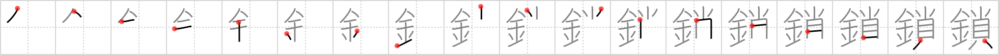

# {鎖}

## Strokes: 18

## Reading:

### On-Yomi: サ &mdash; Kun-Yomi: くさり、とざ.す

### Examples: 鎖 (くさり)

## Words:

封鎖(ふうさ): blockade, freezing (funds)

閉鎖(へいさ): closing, closure, shutdown, lockout, unsociable

鎖(くさり): chain
