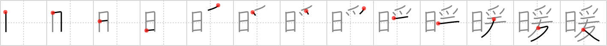

# {1949}

## `warmth`

## [13]

## Reading:

### On-Yomi: ダン、ノン &mdash; Kun-Yomi: あたた.か、あたた.かい、あたた.まる、あたた.める

### Examples: 暖か (あたた.か), 暖かい (あたた.かい), 暖まる (あたた.まる), 暖める (あたた.める)

## Words:

暖まる(あたたまる): to warm oneself, to sun oneself, to warm up, to get warm

暖める(あたためる): to warm, to heat

温暖(おんだん): warmth

暖房(だんぼう): heating

暖かい(あたたかい): warm, mild, genial
