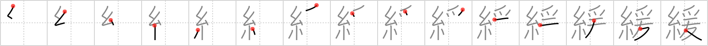

# {1952}

## `slacken`

## [15]

## Reading:

### On-Yomi: カン &mdash; Kun-Yomi: ゆる.い、ゆる.やか、ゆる.む、ゆる.める

### Examples: 緩い (ゆる.い), 緩む (ゆる.む), 緩める (ゆる.める), 緩やか (ゆる.やか)

## Words:

緩和(かんわ): relief, mitigation

緩む(ゆるむ): to become loose, to slacken

緩める(ゆるめる): to loosen, to slow down

緩やか(ゆるやか): lenient

緩い(ゆるい): loose, lenient, slow
