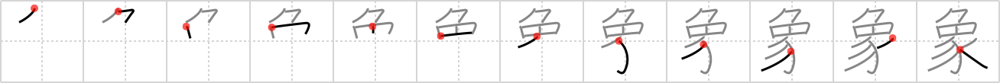

## {1976}

## `elephant`

## [12]

## Reading:

### On-Yomi: ショウ、ゾウ &mdash; Kun-Yomi: かたど.る

### Examples: 象徴 (しょうちょう), 対象 (たいしょう), 現象 (げんしょう)

## Words:

気象(きしょう): weather, climate

象(しょう): phenomenon

象徴(しょうちょう): symbol

印象(いんしょう): impression

現象(げんしょう): phenomenon

象(ぞう): elephant

対象(たいしょう): target, object (of worship, study, etc.)

抽象(ちゅうしょう): abstract
