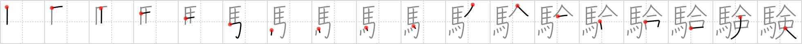

## {1980}

## `verification`

## [18]

## Reading:

### On-Yomi: ケン、ゲン &mdash; Kun-Yomi: あかし、しるし、ため.す、ためし

### Examples: 試験 (しけん), 経験 (けいけん), 実験 (じっけん)

## Words:

体験(たいけん): personal experience

実験(じっけん): experiment

受験(じゅけん): taking an examination

経験(けいけん): experience

試験(しけん): examination
