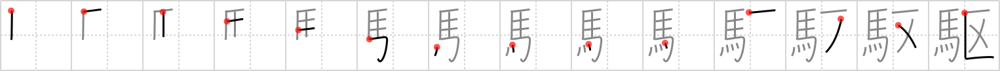

## {1983}

## `drive`

## [14]

## Reading:

### On-Yomi: ク &mdash; Kun-Yomi: か.ける、か.る

### Examples: 駆ける (か.ける), 駆る (か.る)

## Words:

駆け足(かけあし): running fast, double time

駆けっこ(かけっこ): (foot) race

駆ける(かける): to run (race esp. horse), to gallop, to canter
