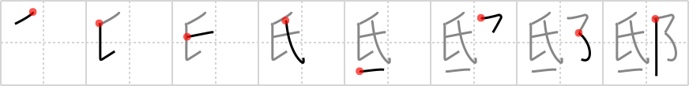

## `residence`

## [8]

## Reading:

### On-Yomi: テイ &mdash; Kun-Yomi: やしき

## Heisig story:

Calling card . . . city walls.

## Premitive:

city walls On the left, and rather more pressed in its form, this element meant the high spot of a village, or its pinnacle. On the right side, in the form shown here, it means the lowest part of the city, around which its walls rise up as a protection against invaders. Hence we nickname this element: city walls. [3]

## Koohii stories:

1) [<a href="http://kanji.koohii.com/profile/QuackingShoe">QuackingShoe</a>] 22-7-2008(151): So fed up am I, I&#039;ve finally built <em>city walls</em> around my<strong> residence</strong> to keep these Japanese from soliciting me with their <em>business cards</em>.

2) [<a href="http://kanji.koohii.com/profile/Perry">Perry</a>] 28-4-2010(87): The <em>business card</em> says his<strong> residence</strong> is just to the left of the <em>city walls</em>. Can you find it? Yep, got it.

3) [<a href="http://kanji.koohii.com/profile/scotty28">scotty28</a>] 2-8-2009(85): Suggestion- since we have the pinnacle on the left(which had a great potential for imaginative stories as we explored the ultimate society), the right side will be the pinnacle&#039;s opposite - the slum. It&#039;s so dangerous that a steep menacing city wall has been erected to keep its denizens in(and protect those outside). story: If your calling card said your<strong> residence</strong> was the slum, you&#039;d be too ashamed to show it to anyone.

4) [<a href="http://kanji.koohii.com/profile/adrianbarritt">adrianbarritt</a>] 28-8-2007(45): There are so many places of<strong> residence</strong> inside the city walls, I put a calling card outside mine so I can find my way home.

5) [<a href="http://kanji.koohii.com/profile/Odieone">Odieone</a>] 18-1-2009(12): My <em>business card</em> shows that my<strong> residence</strong> is within the <em>city walls</em>.

6) [<a href="http://kanji.koohii.com/profile/chibimizuno">chibimizuno</a>] 26-4-2009(11): I like Renaissance&#039;s idea to use the &quot;City Walls&quot; primitive as Mr. Burns. <em>Mr. Burns</em> gave me his <em>calling card</em> and asked me to visit him at his<strong> residence</strong>. Unfortunately, I guess he forgot because when I got there, he released the hounds!

7) [<a href="http://kanji.koohii.com/profile/dingomick">dingomick</a>] 12-3-2007(10): Middle Easterners mark their <strong>residence</strong> with a <em>business card</em> wedged in the <em>city walls</em>, kinda like the wailing wall.

8) [<a href="http://kanji.koohii.com/profile/Renaissance">Renaissance</a>] 18-11-2009(9): I find city walls hard as a primitive, so I make the B, in case it&#039;s on the right, <strong>Mister Burns</strong>, and Mister Burns&#039; domain. Mister Burns gave me his business card. On the card, there&#039;s a picture of his awesome<strong> residence</strong> inside his domain.

9) [<a href="http://kanji.koohii.com/profile/kanjihito">kanjihito</a>] 25-9-2010(5): The <em>calling card</em> revealed his<strong> residence</strong> was within the <em>city walls</em>.

10) [<a href="http://kanji.koohii.com/profile/karmatheif">karmatheif</a>] 16-12-2009(5): Using Scotty28&#039;s idea of <em>slums</em> cordoned off by <em>city walls</em>. The <em>slums</em> are so dangerous that even the solicitor won&#039;t enter to give their <em>business cards</em> to those in<strong> residence</strong>. He simply left (left placement of primitive) his <em>business card</em> just outside the <em>city walls</em> and quickly got outta there! RTK2:　テイ 私邸 してい(private<strong> residence</strong>)...　Pure Group: 低 1831 抵 1832 底 1833.

### {V4: 1841, V6: 1984}
