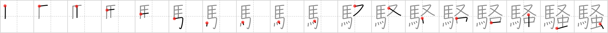

# {1985}

## `boisterous`

## [18]

## Reading:

### On-Yomi: ソウ &mdash; Kun-Yomi: さわ.ぐ、うれい、さわ.がしい

### Examples: 騒ぐ (さわ.ぐ)

## Words:

騒動(そうどう): strife, riot, rebellion

騒がしい(さわがしい): noisy

騒ぎ(さわぎ): uproar, disturbance

騒音(そうおん): noise

騒々しい(そうぞうしい): noisy, boisterous

物騒(ぶっそう): dangerous, disturbed, insecure

騒ぐ(さわぐ): make a noise
