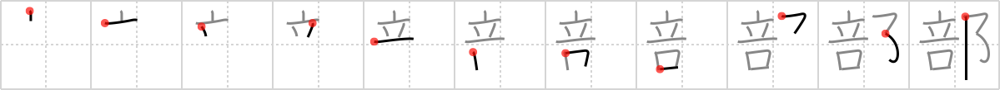

## `section`

## [11]

## Reading:

### On-Yomi: ブ &mdash; Kun-Yomi: -べ

## Heisig story:

Muzzle . . . city walls.

## Koohii stories:

1) [<a href="http://kanji.koohii.com/profile/Copycatken">Copycatken</a>] 28-6-2006(155): Within the <em>city walls</em>, this<strong> section</strong> of town was so noisy that we had to <em>muzzle</em> them up.

2) [<a href="http://kanji.koohii.com/profile/stehr">stehr</a>] 22-11-2007(34): &quot;<strong>Section</strong> 8 housing&quot; is a way to <em>muzzle</em> the impoverished people who are unable to pay rent but want to live inside the <em>city walls</em>.

3) [<a href="http://kanji.koohii.com/profile/scotty28">scotty28</a>] 2-8-2009(21): (primitive city walls - slum. See residence 1841) A riot happens in one<strong> section</strong> of the slum. Rioting about the poor living conditions and treatment by the authorities. That<strong> section</strong> of the slum have muzzels fixed on them. Such demeaning treatment is typical in the slum.

4) [<a href="http://kanji.koohii.com/profile/liosama">liosama</a>] 13-4-2009(19): The illegal israeli settlement has already muzzled the fuck out of all the land, so in order to further claim their (unwanted) presence. They muzzle the land (200m on both sides) of the Apartheid wall to<strong> section</strong> and part the land.

5) [<a href="http://kanji.koohii.com/profile/synewave">synewave</a>] 1-12-2006(14): <strong>Sectioning</strong> is a term used in the UK that refers to putting a <em>muzzle</em> on someone and taking them inside the <em>city walls</em> to a mental hospital.

6) [<a href="http://kanji.koohii.com/profile/Howdoken">Howdoken</a>] 1-6-2008(10): Public Security<strong> SECTION</strong> 9 keep a MUZZLE on cyber-criminals within Niihama-shi (New Port City)&#039;s CITY WALLS.

7) [<a href="http://kanji.koohii.com/profile/Virtua_Leaf">Virtua_Leaf</a>] 11-10-2009(8): For a little while after the Hiroshima bomb, there were still<strong> section</strong>s within the <em>city walls</em> where you had to be <em>muzzled</em> by a gas mask due to the remnants of toxic gas.

8) [<a href="http://kanji.koohii.com/profile/inuki">inuki</a>] 1-11-2006(5): When the rich see the poor<strong> section</strong>s of their town, they wish that they could muzzle the poor folk. Or better yet, build a city wall between the affluent<strong> section</strong> and the ghetto.

9) [<a href="http://kanji.koohii.com/profile/kanjihito">kanjihito</a>] 3-4-2012(4): They would <em>muzzle</em> off<strong> section</strong> by<strong> section</strong> until all within the <em>city walls</em> was secured (compare with <a href="../v4/1842">enclosure</a> (#1842 郭)).

10) [<a href="http://kanji.koohii.com/profile/Renaissance">Renaissance</a>] 18-11-2009(4): The 部長 (section manager) of <em>Mr. Burns</em>&#039; powerplant is Smithers, but Mr. Burns always keeps him <em>muzzled</em>.

### {V4: 1845, V6: 1988}
