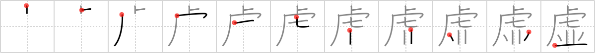

## `void`

## [11]

## Reading:

### On-Yomi: キョ、コ &mdash; Kun-Yomi: むな.しい、うつ.ろ

## Heisig V6:

Tigers . . . row.

## Koohii stories:

1) [<a href="http://kanji.koohii.com/profile/rtkrtk">rtkrtk</a>] 17-3-2008(198): In Japanese folklore there is no hell, but there is the<strong> void</strong>. There, a <em>row</em> of <em>tigers</em> waits in the blackness to devour those souls who have failed in their spiritual life.

2) [<a href="http://kanji.koohii.com/profile/Peppi">Peppi</a>] 2-7-2009(82): If you stand in a <em>row of tigers</em> (tiger - you - tiger) there will soon be a<strong> void</strong> (tiger -<strong> void</strong> - tiger).

3) [<a href="http://kanji.koohii.com/profile/inuki">inuki</a>] 6-2-2007(38): Warning to Sigfreid and Roy: Your entertainment contract will be null and<strong> void</strong> unless you can make all the tigers stand in a row.

4) [<a href="http://kanji.koohii.com/profile/raulir">raulir</a>] 7-1-2007(15): When a row of tigers surrounds you, life will feel hollow and<strong> void</strong>.

5) [<a href="http://kanji.koohii.com/profile/dingomick">dingomick</a>] 16-3-2007(13): In the book &quot;The Life of Pi&quot;, Pi and the <em>tiger</em> are shipwrecked on a <em>rowboat</em> for 227 days. Pi keeps as large a <strong>void</strong> as possible between them.

6) [<a href="http://kanji.koohii.com/profile/Balaam">Balaam</a>] 7-2-2008(7): Your ipods warranty is<strong> void</strong> if eaten by two tigers in a row.

7) [<a href="http://kanji.koohii.com/profile/Crowfoot">Crowfoot</a>] 12-4-2008(5): The <em>penguins</em> are <em>standing in their front row seats</em> watching the performing <em>tigers</em> when they&#039;re told by security that their tickets are<strong> void</strong> and they&#039;ve got to go. Apparently, their cheque bounced. See the disappointed <em>penguins</em> shuffling out of their <em>front row seats</em>.

8) [<a href="http://kanji.koohii.com/profile/rgravina">rgravina</a>] 18-11-2006(5): Here <em>tigger</em> tries his hand at programming in C. int main(<strong>void</strong>) he types, then whistles contently as he procedes to type <em>row</em> after <em>row</em> of code into into his emacs editor.

9) [<a href="http://kanji.koohii.com/profile/bergaap">bergaap</a>] 2-12-2008(4): For those using <em>rowboat</em> instead of <em>row</em> as a primitive: think of a darkride at an amusement park where your little guided <em>rowboat</em> is about to enter into a huge <em>tiger</em>&#039;s mouth: a dark and unknown<strong> void</strong>.

10) [<a href="http://kanji.koohii.com/profile/fuaburisu">fuaburisu</a>] 13-3-2006(4): Note : I use the image of a <em>rowing boat</em> for the second primitive (see <a href="../1785">row</a> (#1785 並)). Some kid and his mummy turn in a coupon they have found in a biscuit box (for example), to receive a free plastic toy, representing <em>tigers in a rowing boat</em> (it&#039;s the Olympic season?). The uncompromising shop clerk says the coupon is<strong> void</strong> (it is not valid anymore), much to the dismay of the poor kid. Taking the word &quot;void&quot; in the sense of &quot;not valid&quot; also hints at another meaning of the kanji : &quot;untruth&quot;.
