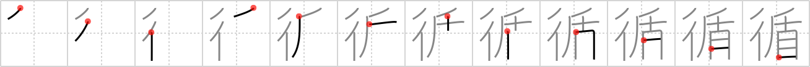

## `sequential`

## [12]

## Reading:

### On-Yomi: ジュン

## Heisig story:

Line . . . shield.

## Koohii stories:

1) [<a href="http://kanji.koohii.com/profile/raulir">raulir</a>] 2-1-2007(216): This is mostly used in the word 循環 , &quot;circulation&quot; (of buses through their routes, of blood, etc). So I think of a column of little Roman soldiers with their shields marching<strong> sequential</strong>ly through the veins of a person, as an anthropomorphization of the immune system.

2) [<a href="http://kanji.koohii.com/profile/mspertus">mspertus</a>] 20-4-2007(61): A <em>column</em> of <em>shielded</em> soldiers advancing<strong> sequential</strong>ly to avoid revealing the size of their army (Think &quot;Sandpeople always ride single file to hide their numbers&quot; from Star Wars).

3) [<a href="http://kanji.koohii.com/profile/CharleyGarrett">CharleyGarrett</a>] 23-4-2007(15): <em>Flash</em> can defeat the protection of the <em>shield</em>. The <em>ten</em> <em>eyes</em> open momentarily, but one after the other. He can blind them in a <strong>sequential</strong> fashion, and then attack an effectively blind opponent who cannot then <em>drag</em> the shield to meet the attack.

4) [<a href="http://kanji.koohii.com/profile/jabberwockychortles">jabberwockychortles</a>] 10-2-2010(14): An army&#039;s <em>column</em> of marching <em>sheilds</em>, are lined up in<strong> sequential</strong> order.

5) [<a href="http://kanji.koohii.com/profile/TheSlakey">TheSlakey</a>] 4-1-2009(12): The adventurers go in<strong> sequential</strong> order, with the shield bearing warrior in front to shield the other party members.

6) [<a href="http://kanji.koohii.com/profile/dihutenosa">dihutenosa</a>] 2-1-2008(6): <em>Lance Armstrong</em> is racing in a crazy<strong> sequential</strong> obstacle course. He has to bike up different locations and do some sort of activity in each one, in the proper order. At each location, he jumps his bike in the air and smacks a dude holding a <em>shield</em> with his rear tire - this shows that he&#039;s done with the activity in that area.

7) [<a href="http://kanji.koohii.com/profile/Boogiepop">Boogiepop</a>] 24-8-2009(4): <strong>Kreislauf</strong> des Lebens, dargestellt in Form einer <em>Menschenschlange</em> auf einem <em>Schild</em>, die sich selbst in den Schwanz beißt.

8) [<a href="http://kanji.koohii.com/profile/myglagata">myglagata</a>] 3-8-2009(3): The Tour de France has<strong> sequential</strong> stages that go round the whole country! <em>Lance Armstrong</em> buys miniature <em>shields</em> or coat of arms at each stop.

9) [<a href="http://kanji.koohii.com/profile/Tornadic_Indignation">Tornadic_Indignation</a>] 27-7-2009(3): <em>The Flash</em> is so fast that he doesn&#039;t have to use a <em>shield</em>. He<strong> sequential</strong>ly dodges after one of his pathetic enemy&#039;s attacks.

10) [<a href="http://kanji.koohii.com/profile/mezbup">mezbup</a>] 6-7-2009(3): A<strong> sequential</strong> line of shields = the riot police.

### {V4: 1854, V6: 1998}
