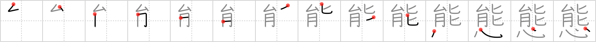

# {態}

## `attitude`

## Strokes: 14

## Reading:

### On-Yomi: タイ &mdash; Kun-Yomi: わざ.と

## Words:

形態(けいたい): form, shape, figure

実態(じったい): truth, fact

態勢(たいせい): attitude, conditions, preparations

態々(わざわざ): expressly, specially, doing something especially rather than incidentally

事態(じたい): situation, present state of affairs, circumstances

状態(じょうたい): current status, condition, situation, circumstances, state

態度(たいど): attitude, manner
