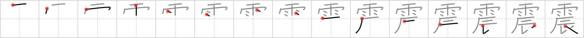

# {2010}

## `quake`

## [15]

## Reading:

### On-Yomi: シン &mdash; Kun-Yomi: ふる.う、ふる.える

### Examples: 震う (ふる.う), 震える (ふる.える)

## Words:

震わせる(ふるわせる): to be shaking, to be trembling

震える(ふるえる): shiver, shake, quake

地震(じしん): earthquake
