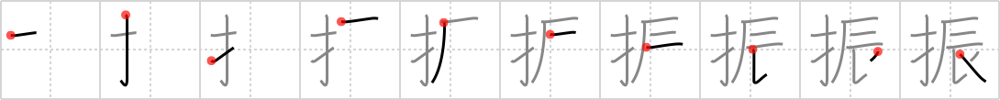

# {振}

## `shake`

## Strokes: 10

## Reading:

### On-Yomi: シン &mdash; Kun-Yomi: ふ.る、ぶ.る、ふ.り、-ぶ.り、ふ.るう

### Examples: 振る (ふ.る), 振るう (ふ.るう)

## Words:

振興(しんこう): promotion, encouragement

振動(しんどう): oscillation, vibration

久し振り(ひさしぶり): after a long time

不振(ふしん): dullness, depression, slump, stagnation

振り(ふり): pretence, show, appearance

振り出し(ふりだし): outset, starting point, drawing or issuing (draft)

身振り(みぶり): gesture

振り仮名(ふりがな): hiragana over kanji, pronunciation key

振る(ふる): wave, shake, swing, sprinkle, cast (actor), allocate (work)

振舞う(ふるまう): behave, conduct oneself, entertain
