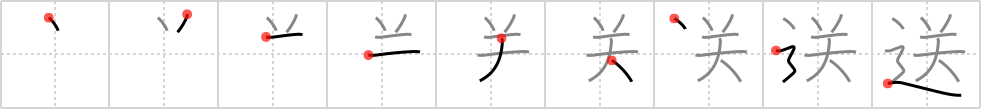

# {2016}

## `send off`

## [9]

## Reading:

### On-Yomi: ソウ &mdash; Kun-Yomi: おく.る

### Examples: 送る (おく.る)

## Words:

運送(うんそう): shipping, marine transportation

回送(かいそう): forwarding

送金(そうきん): remittance, sending money

送り仮名(おくりがな): kana written after a kanji to complete the full (usually kun) reading of the word

送る(おくる): send (a thing), take or escort (a person somewhere), see off (a person), spend a period of time, live a life

送別(そうべつ): farewell, send-off

送料(そうりょう): postage

見送り(みおくり): seeing one off, farewell, escort

見送る(みおくる): see off, escort, let pass, wait and see

郵送(ゆうそう): mailing

輸送(ゆそう): transport, transportation

放送(ほうそう): broadcasting
