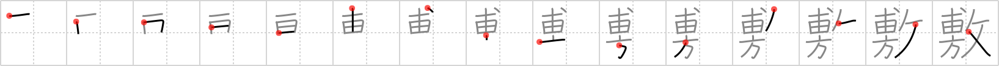

## `spread`

## [15]

## Reading:

### On-Yomi: フ &mdash; Kun-Yomi: し.く、-し.き

## Heisig story:

At the top we have the <i>arrowhead</i> whose vertical line joins it to the <i>rice field</i> (or <i>brains</i>) below it. Beneath it, the <i>compass</i>; and to the right, the <i>taskmaster</i>.

## Koohii stories:

1) [<a href="http://kanji.koohii.com/profile/dingomick">dingomick</a>] 14-3-2007(201): <em>Arrowheads</em> are <strong>spread</strong> all over the <em>field</em>. The <em>taskmaster</em> profiteerer forces you to find them all using a <em>compass</em>.

2) [<a href="http://kanji.koohii.com/profile/Harrow">Harrow</a>] 23-3-2009(129): Instead of being glued to one <a href="../46">specialty</a> (#46 専) 専 , I decided to<strong> spread</strong> my attention in many directions 方 , and be a taskmaster at none.

3) [<a href="http://kanji.koohii.com/profile/radical_tyro">radical_tyro</a>] 17-7-2007(67): Gory story: Instead of <em>setting you free</em>, the taskmaster said &quot;Spread em!&quot;, raped you, and drove an <em>arrowhead</em> into your <em>brain</em>.

4) [<a href="http://kanji.koohii.com/profile/sarek05">sarek05</a>] 14-10-2008(36): I assasinated the <em>taskmasker</em>. When the arrowhead hit his <em>brain</em>, bits and pieces<strong> spread</strong> out in all <em>directions</em>.

5) [<a href="http://kanji.koohii.com/profile/karmatheif">karmatheif</a>] 19-1-2010(13): This is the （しき）used in ふろしき 風呂敷 , which is when the Japanese bundle something in a large cloth, then gather the ends togther and tie it at the top to carry it around. Story: Imagine an eccentric <em>taskmaster</em> who feels the need to carry a gigantic ふろしき everywhere for his picnics, so he can<strong> spread</strong> it in all <em>directions</em>, cover a whole <em>field</em> and pins the corners to the ground with stone <em>arrowheads</em>.

6) [<a href="http://kanji.koohii.com/profile/narazumono">narazumono</a>] 20-1-2009(10): <strong>Spread</strong> the word. The kid who got an <em>arrowhead</em> in his <em>brain</em> was <em>set free</em> from the hospital to<strong> spread</strong> the news about archery safety. <a href="http://www.amazon.com/Broken-Arrow-Boy-Adam-Moore/dp/0933849249">http://www.amazon.com/Broken-Arrow-Boy-Adam-Moore/dp/0933849249</a>.

7) [<a href="http://kanji.koohii.com/profile/romanrozhok">romanrozhok</a>] 11-3-2008(9): This can be used in<strong> SPREAD</strong>ING a sheet over a bed. STORY: A giant TASKMASTER is ordering the slaves on how to<strong> SPREAD</strong> a large sheet over the RICE FIELD. It must be precise, so they use a COMPASS to get the corners facing just right, and ARROWS to keep the SHEET in place.

8) [<a href="http://kanji.koohii.com/profile/jabberwockychortles">jabberwockychortles</a>] 14-1-2010(8): I saw the <em>brains</em><strong> spread</strong> in all <em>directions</em> when the <em>arrowhead</em> hit. The suspect is the <em>taskmaster</em>.

9) [<a href="http://kanji.koohii.com/profile/cords">cords</a>] 12-7-2008(6): The taskmasters have developed a new homing arrow (Arrow with a compass and a brain) to take down anyone who trys to escape.<strong> Spread</strong> the word! (thanks to thermal for homing arrow).

10) [<a href="http://kanji.koohii.com/profile/raulir">raulir</a>] 2-1-2007(4): The left side is an acupuncturist who uses compass needles for his work (compass replaces the glue). To lure customers in, he<strong> spread</strong>s nice sheets on the place where they will lie down, and then gets a taskmaster to keep them in place so they can&#039;t flee when they realize that this acupuncturist doesn&#039;t play with a full deck.
