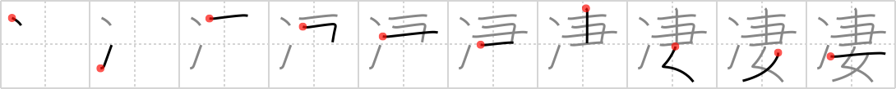

## `nifty`

## [10]

## Reading:

### On-Yomi: セイ、サイ &mdash; Kun-Yomi: さむ.い、すご.い、すさ.まじい

## Heisig story:

Ice . . . wife.

## Koohii stories:

1) [<a href="http://kanji.koohii.com/profile/danie115">danie115</a>] 21-11-2008(72): Sugoi! Sugoi! Ice Wife Sugoi!

2) [<a href="http://kanji.koohii.com/profile/astridtops">astridtops</a>] 15-12-2006(48): His <em>wife</em> has a<strong> nifty</strong> way of making all types of <em>ice</em> cream in her home freezer.

3) [<a href="http://kanji.koohii.com/profile/herman">herman</a>] 20-11-2008(40): I prefer keyword &quot;terrific&quot; for this as the Japanese meaning can be either &quot;great&quot; or &quot;dreadful&quot;. Story: freezing your wife is a terrific idea, she can still look pretty and you don&#039;t have to listen to all the nagging.

4) [<a href="http://kanji.koohii.com/profile/tuuli">tuuli</a>] 12-11-2008(28): A word like<strong> nifty</strong> makes you think of the 50&#039;s, and a <em>housewife</em> so impressed with the new <em>freeze</em>r that she says &quot;oh, how<strong> nifty</strong>!&quot;.

5) [<a href="http://kanji.koohii.com/profile/Elphalpo">Elphalpo</a>] 8-7-2012(12): My <em>ice-cold wife</em> would beat me down if I ever insulted her, so I often tell her she&#039;s <strong>凄い</strong> (sugoi), which she takes to mean amazing but what I actually mean is dreadful. ------------------------- (I use すごい (sugoi) as a keyword because I already know it, but if you wanna use an English keyword, I like herman&#039;s suggestion of &quot;terrific.&quot;).

6) [<a href="http://kanji.koohii.com/profile/DrWarrior12">DrWarrior12</a>] 25-1-2009(9): Check out this<strong> nifty</strong> device I just got! When my <em>wife</em> starts nagging on me, I just point the nozzle at her and fire! She <em>freezes</em> instantly!

7) [<a href="http://kanji.koohii.com/profile/jabberwockychortles">jabberwockychortles</a>] 13-6-2010(5): His <em>wife</em> is cold as <em>ice</em> but he thinks she&#039;s<strong> nifty</strong> 凄い （すごい）.

8) [<a href="http://kanji.koohii.com/profile/Machine_Gun_Cat">Machine_Gun_Cat</a>] 8-7-2009(5): I have the<strong> nifty</strong> yet very immoral ability to <em>freeze</em> time and cheat on my <em>wife</em> with whichever hot chicks I find walking the street without either of them being any the wiser.

9) [<a href="http://kanji.koohii.com/profile/morganandrew">morganandrew</a>] 28-4-2011(3): すごいね！Is the only thing that I can summon up the courage to say after my friend gets his WIFE to do her ICE-CUBE trick for us.

10) [<a href="http://kanji.koohii.com/profile/mcfate">mcfate</a>] 14-10-2007(3): I made the yuki-onna (<em>ice</em> <em>woman</em>) my <em>wife</em>. Isn&#039;t that a<strong> nifty</strong> way to avoid dying of exposure, like all the poor guys usually do in that traditional story?
