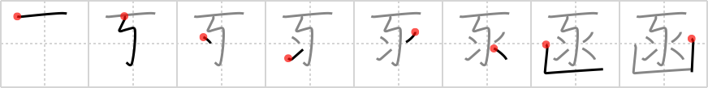

## `bin`

## [8]

## Reading:

### On-Yomi: カン &mdash; Kun-Yomi: はこ、い.れる

## Heisig story:

This is the character from which the element for <i>shovel</i> derives. Within it comes the element for <i>snare</i>, with the <i>sparkler</i> surrounding it.

## Koohii stories:

1) [<a href="http://kanji.koohii.com/profile/thegeezer3">thegeezer3</a>] 1-7-2007(206): Damn racoons ill show them. I put a snare in the<strong> bin</strong> as well as a few phosphorous sparklers so as to scare the shit out of the buggers as they rummage through my<strong> bin</strong>.

2) [<a href="http://kanji.koohii.com/profile/smujohnson">smujohnson</a>] 2-3-2009(135): (thegeezer3) Damn racoons... I&#039;ll show them. I&#039;ll put a SNARE in the<strong> BIN</strong> as well as a few SPARKLERS so as to scare the shit out of the buggers, then hit them with a SHOVEL.

3) [<a href="http://kanji.koohii.com/profile/akrodha">akrodha</a>] 12-6-2007(40): A typical German apartment has five different kind of trash<strong> bin</strong>s: paper, plastic, glass, biodegradable, and everything else. Don&#039;t you dare throw your trash in the wrong<strong> bin</strong>, or else you&#039;ll find yourself on the wrong side of a booby trap: hung by a <em>snare</em>, burned by <em>sparklers</em>, and knocked out cold by a <em>shovel</em>.

4) [<a href="http://kanji.koohii.com/profile/ayoung24">ayoung24</a>] 24-12-2006(25): (Reformatted from erikkusan) The Windows Recycle<strong> Bin</strong> is like a <em>snare</em> holding onto your trash. When you empty it, a window displays little <em>sparkles</em> as the files are <em>shoveled</em> off of your hard drive.

5) [<a href="http://kanji.koohii.com/profile/raulir">raulir</a>] 2-1-2007(14): This is alternative way of writing 箱 , used in e.g. 函館 (はこだて) and sometimes as is. This<strong> bin</strong> is actually a snare with a powerful sparkler in it that kills rats that enter it, the remains of which are then shoveled away (to a &quot;recycle<strong> bin</strong>&quot; perhaps).

6) [<a href="http://kanji.koohii.com/profile/rgravina">rgravina</a>] 27-10-2006(12): This is a<strong> bin</strong> for hazardous materials - namely, <em>snares</em> and <em>sparkles</em>. Throw them in there before entering the customs inspection area!

7) [<a href="http://kanji.koohii.com/profile/icamonkey">icamonkey</a>] 27-6-2009(6): We finally caught <strong>Bin</strong> Laden. We set up a trap <em>snare</em>. When it got him, <em>sparklers</em> went off to notify us. He quickly killed himself with the <em>shovel</em> we left (it&#039;s what we dug the hole with).

8) [<a href="http://kanji.koohii.com/profile/erikkusan">erikkusan</a>] 4-4-2006(6): Can you imagine the recycle<strong> bin</strong> in Windows to be some kind of snare holding onto your trash until you empty it? When you empty it, some programs displays some sparkles before whatever inside your<strong> bin</strong> is shoveled away from your harddisk.

9) [<a href="http://kanji.koohii.com/profile/aberu">aberu</a>] 17-1-2010(4): The waste<strong> bin</strong> was full of <em>fireworks</em> the teacher had <em>snared</em>.

10) [<a href="http://kanji.koohii.com/profile/Elphalpo">Elphalpo</a>] 2-9-2008(3): These damn kids kept putting <em>firecrackers</em> in my trash<strong> bin</strong>, so I decided to catch &#039;em by rigging it with a <em>snare</em>. Well, not only did it catch &#039;em--it killed &#039;em, so of course I went straight for the <em>shovel</em> to dispose of the evidence.
