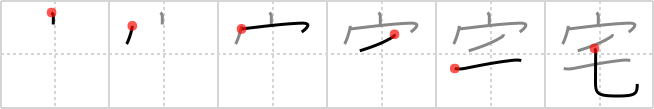

## `home`

## [6]

## Reading:

### On-Yomi: タク

## Heisig story:

House . . . lock of hair.

## Premitive:

lock of hair This element is clearly derived from that for fur. By leaving out the second stroke, we get simply a lock of hair. [3]

## Koohii stories:

1) [<a href="http://kanji.koohii.com/profile/naniwa">naniwa</a>] 18-3-2007(277): This kanji is, of course, pronounced &quot;taku&quot;, and it seems the owner of this<strong> home</strong> is a little bit otaku himself. He has hung up <em>locks of hair</em> suruptitiously obtained from various females all over his <em>house</em>. A veritable hair fetishist, and certainly someone whose<strong> home</strong> you wouldn&#039;t want to visit.

2) [<a href="http://kanji.koohii.com/profile/Terhorst">Terhorst</a>] 13-2-2008(61): &quot;<strong>Home</strong> is where the <em>hair</em> is&quot;.

3) [<a href="http://kanji.koohii.com/profile/Copycatken">Copycatken</a>] 29-6-2006(43): At<strong> home</strong>, all the drains in my <em>house</em> are clogged up with <em>locks of hair</em>.

4) [<a href="http://kanji.koohii.com/profile/nest0r">nest0r</a>] 16-4-2008(20): I&#039;m very paranoid when I finally call my <em>house</em> a<strong> home</strong>, so whenever I leave, I cut a <em>lock of hair</em>, divide it into strands, and place it at all the entrances. If one is displaced, then I know someone has been there! Saw that in a James Bond movie.

5) [<a href="http://kanji.koohii.com/profile/thegeezer3">thegeezer3</a>] 1-7-2007(16): House and locks of hair (goldilocks) = goldilocks broke into the bears house and treat it like her own<strong> home</strong> the selfish bitch.

6) [<a href="http://kanji.koohii.com/profile/harusame">harusame</a>] 23-6-2009(11): This kanji is the <strong>taku</strong> in the word <em>otaku</em>, which originated from describing another&#039;s<strong> home</strong> or family and is used as an honorific form of &quot;you&quot; (second person) but has come to describe someone as having an obsession (i.e. Jesus-freak, anime freak, etc.). This o<strong>taku</strong> has become obsessed with a girl, hanging little <em>locks of hair</em> that he&#039;s stolen from her from his <em>roof</em> and storing them all over his<strong> home</strong>.

7) [<a href="http://kanji.koohii.com/profile/phauna">phauna</a>] 27-2-2008(8): Otakus stay at<strong> home</strong> all the time and go through their collections of pubic <em>hair</em>, obtained from Japanese schoolgirls. (Thanks naniwa and my own collecti...oh wait, nevermind.).

8) [<a href="http://kanji.koohii.com/profile/glongsword">glongsword</a>] 11-5-2010(6): <strong>Home</strong>: you can let your <em>hair</em> down in your <em>house</em>.

9) [<a href="http://kanji.koohii.com/profile/fergal">fergal</a>] 14-11-2009(4): &quot;<strong>Home</strong>! Now!&quot;. Your mother has grabbed a <em>lock of hair</em> and is going to drag you back to your <em>house</em>.

10) [<a href="http://kanji.koohii.com/profile/CountPacula">CountPacula</a>] 30-7-2008(2): A <em>house</em> is not a<strong> home</strong> until it is filled with stray <em>locks of hair</em> all over the place.
