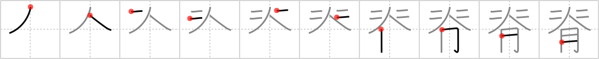

## `spinal column`

## [10]

## Reading:

### On-Yomi: セキ &mdash; Kun-Yomi: せ、せい

## Heisig V6:

The <b>spinal column</b> has sprouted out of the <i>flesh</i> of your back into an <i>umbrella</i> that you always have with you, rain or shine. The pair of 2s on each side are the &quot;ribs&quot; of the <i>umbrella</i>. Take care to keep your image of the key word distinct from that for spine (Frame 24).

## Koohii stories:

1) [<a href="http://kanji.koohii.com/profile/astridtops">astridtops</a>] 8-5-2007(71): &quot;Look&quot;, says the teacher in biology class. &quot;The<strong> spinal column</strong> holds your <em>flesh</em> together, just like the metal rod of this <em>umbrella</em> (he demonstrates this with an umbrella covered in <em>I-Ching</em> symbols) holds the umbrella together&quot;.

2) [<a href="http://kanji.koohii.com/profile/sgrant">sgrant</a>] 27-4-2009(31): A pictograph of a<strong> spinal column</strong>. The <em>umbrella</em> representing the shoulder blades, the <em>I Ching</em> as the shoulder muscles and the <em>part of the body</em> as the spine itself.

3) [<a href="http://kanji.koohii.com/profile/FutureBlues">FutureBlues</a>] 6-10-2008(10): The<strong> spinal column</strong> functions in the same way the rod does in an <em>umbrella</em>... To hold one&#039;s <em>umbrella of flesh</em> together, much like the <em>I Ching</em> does for the universe.

4) [<a href="http://kanji.koohii.com/profile/mantixen">mantixen</a>] 21-7-2009(8): In a horrific accident, a <em>body part</em> got <em>jammed in</em> the <em>grill</em> of my car: a<strong> spinal column</strong>!

5) [<a href="http://kanji.koohii.com/profile/timcampbell">timcampbell</a>] 28-1-2008(6): When my Korean girlfriend (from the I CHING symbols on the Korean flag) stands under an UMBRELLA and stretches her BODY, you can see the outline of her<strong> spinal column</strong>.

6) [<a href="http://kanji.koohii.com/profile/chibimizuno">chibimizuno</a>] 24-5-2009(5): This kanji illustrates a horrible car accident... a pedestrian was walking along carrying an umbrella, when the wind blew so strongly that the <em>umbrella</em> pulled her into the <em>grill</em> of a car! The only <em>body part</em> left was a<strong> spinal column</strong> lying on the road...

7) [<a href="http://kanji.koohii.com/profile/eri401">eri401</a>] 15-7-2011(4): O セキ k せ, せい Seems to be old form of 背 or <a href="../446">stature</a> (#446 背). They used to check your stature by seeing the northern most point of your flesh. They then check how straight your<strong> spinal column</strong> is by leaning you up against an umbrella. As long as you measure within 2 cm on each side, it is straight. 脊髄 【せきずい】 (n,adj-no) spinal cord.

8) [<a href="http://kanji.koohii.com/profile/CountPacula">CountPacula</a>] 3-1-2009(3): <strong>WARNING</strong>: grotesque imagery ahead. In the Saw movie series (if you don&#039;t know it, look away while you still can...), one of the traps was designed to pull it&#039;s victim&#039;s <em>rib cage</em> away from their <em>flesh</em> like a macabre <em>umbrella</em>, leaving only the<strong> spinal column</strong> holding everything together.

9) [<a href="http://kanji.koohii.com/profile/jusenkyoguide">jusenkyoguide</a>] 5-11-2012(2): <em>Two</em> ribs to the left, <em>two</em> ribs to the right, an <em>umbrella</em> for a head, and a strip of <em>flesh</em> for the<strong> spinal column</strong>. Thus is our creature made.

10) [<a href="http://kanji.koohii.com/profile/decals">decals</a>] 21-8-2010(2): I Ching = Korea (The I Ching are on the Korean flag) STORY: The best cuts of meat (flesh) for Korean BBQ are all next to the<strong> spinal column</strong>. People will stand outside in the rain, umbrellas up, waiting for it to come in to the butcher shop.
