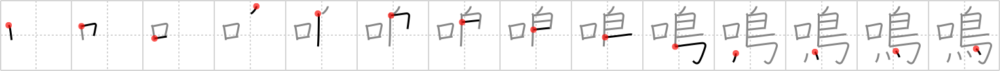

## `chirp`

## [14]

## Reading:

### On-Yomi: メイ &mdash; Kun-Yomi: な.く、な.る、な.らす

## Heisig story:

Mouth . . . bird.

## Koohii stories:

1) [<a href="http://kanji.koohii.com/profile/darg_sama">darg_sama</a>] 25-10-2005(219): A<strong> chirp</strong> is quite simply the sound that comes from the mouth of birds.

2) [<a href="http://kanji.koohii.com/profile/DrJones">DrJones</a>] 24-7-2008(91): This kanji is not limited to the<strong> chirp</strong> of a <em>bird</em>, but stands for the sound of any kind of animal. Picture a very weird bird that can imitate with its <em>mouth</em> (a bird with mouth, heh) the voice of many different animals: Meeow! Woof! Mooo! Cuack!!! (Maybe the bird has Kirby powers and obtains the abilities of the animals it eats).

3) [<a href="http://kanji.koohii.com/profile/wilsoncb">wilsoncb</a>] 4-3-2010(55): Just 100 left to go! <a href="http://google.com/#q=頑張れ！">頑張れ！</a> .

4) [<a href="http://kanji.koohii.com/profile/testoman">testoman</a>] 23-9-2008(15): Addition to DrJones&#039; story: the bird that can mimic other animals (and then some!) is a Lyrebird. Check <a href="http://www.youtube.com/watch?v=VjE0Kdfos4Y">http://www.youtube.com/watch?v=VjE0Kdfos4Y</a> to see one in action.

5) [<a href="http://kanji.koohii.com/profile/kanjihito">kanjihito</a>] 27-7-2011(4): <strong>Chirp</strong> is the sound which comes from the <em>mouths</em> of <em>birds</em>.

6) [<a href="http://kanji.koohii.com/profile/delbertmon">delbertmon</a>] 26-1-2010(4): A<strong> chirp</strong> comes from the <em>mouth</em> of <em>birds</em>. (less wordy mod of darg sama).

7) [<a href="http://kanji.koohii.com/profile/dalmim">dalmim</a>] 23-9-2011(2): The <em>mouth</em> of the <em>bird</em> goes<strong> CHIRP</strong>,<strong> CHIRP</strong>,<strong> CHIRP</strong>.

8) [<a href="http://kanji.koohii.com/profile/kapalama">kapalama</a>] 16-3-2011(2): 鳴く , 鳴る <a href="../v4/1942">chirp</a> (#1942 鳴) メイ, なる, なく, ならす ... Parts: 口 , 鳥 ... Similiars: 吠える <a href="../v4/2170">barking</a> (#2170 吠), 哭く<a href="../v4/21741">Unicode-0x54ed</a> (#21741 哭) (Cry of the wolf), , 吼える <a href="../v4/21564">Unicode-0x543c</a> (#21564 吼)(Lion&#039;s Roar), 泣く <a href="../v4/432">cry</a> (#432 泣) ... Note: Not just animal noises; rather Noises that resemble bird calls to some degree. Phones 鳴る , Tinnitus is 耳鳴り , and shouting people even 怒鳴る . So non animals 鳴る , and some animals don&#039;t: Dogs 吠える . But Cows do: 牛の鳴き声 .

9) [<a href="http://kanji.koohii.com/profile/to_nihon">to_nihon</a>] 21-11-2008(2): Classroom scene: &quot;Opening its <em>mouth</em>, the <em>bird</em> lets forth a huge...&quot; &quot;Burp?&quot; interjects Billy, the prankster of the class. The class laughs. &quot;<strong>Chirp</strong>,&quot; the teacher continues, giving Billy a stern look.

10) [<a href="http://kanji.koohii.com/profile/romanrozhok">romanrozhok</a>] 17-3-2008(2): This kanji means &quot;to sound.&quot; STORY: The morning began TO SOUND with the melody coming from the BIRD&#039;S MOUTHS.
