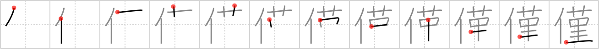

# {僅}

## `trifle`

## Strokes: 12

## Reading:

### On-Yomi: キン、ゴン &mdash; Kun-Yomi: わずか

### Examples: 僅 (わずか)

## Words:

僅(きん): a little, small quantity

僅か(わずか): only, merely, a little, small quantity
