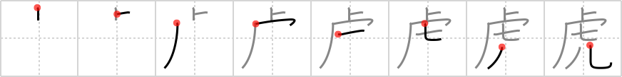

## `tiger`

## [8]

## Reading:

### On-Yomi: コ &mdash; Kun-Yomi: とら

## Heisig story:

The kanji in this frame recalls the famous Bengali fable about the group of magicians (the <i>magic wand</i>) who decided to make a <b>tiger</b>. It seems that each of them knew how to make one part of the beast, so they pooled their talents and brought all the pieces (<i>diced</i> into pieces) together, at which point the fabricated <b><i>tiger</i></b> promptly ate its makers up (the bodiless <i>human legs</i>). Whatever the parable's significance for modern civilization and its arsenals, it should help with this kanji. Oh yes, we should not forget that cliff-like element. Think of it as an abbreviation of the primitive for <i>zoo</i> (the first and fourth strokes, actually), in order to fit the <b>tiger</b> somewhere into the picture. In fact, the abbreviation is perfectly logical, since the bottom elements usurp the room for the rest of the primitive for <i>zoo</i>.

## Premitive:

As a primitive element itself, the human legs are also swallowed up, but the meaning of tiger is kept, and the whole serves as a roof for what comes beneath, --, giving the tiger something else to eat.

## Koohii stories:

1) [<a href="http://kanji.koohii.com/profile/raulir">raulir</a>] 9-4-2007(122): Magic wand + first two strokes of pelt ( 皮 ) + diced + human legs. A wizard who turns people he doesn&#039;t like into newts with his magic wand goes for variety - he has always wanted a<strong> tiger</strong> pelt - but things go awry when the<strong> tiger</strong> promptly dices and eats him, leaving only a pair of legs. (a fitting end for a wicked wizard).

2) [<a href="http://kanji.koohii.com/profile/CharleyGarrett">CharleyGarrett</a>] 23-4-2007(107): <strong>Tigger, the<strong> tiger</strong></strong>, (from Pooh stories) is happy to have found a <em>magic wand</em>. Using it he can bounce up to a the top of a <em>cliff</em>, <em>seven</em> times as high as some <em>human legs</em> could bounce. <strong>Tigger</strong> thinks &quot;Its great to be a <strong>tiger</strong>!

3) [<a href="http://kanji.koohii.com/profile/Filip">Filip</a>] 10-3-2008(50): The 7 very smart magicians were standing on top of a cliff. The 7 very smart magicians wanted to create a<strong> tiger</strong>. The smart<strong> tiger</strong> ate 6 and a half magicians, leaving a pair of human legs as a snack for later. The smart<strong> tiger</strong> hang the pair of human legs on a tiny hook, so that no other predator could reach it. Moral of the story:<strong> tiger</strong> wins.

4) [<a href="http://kanji.koohii.com/profile/uberclimber">uberclimber</a>] 18-12-2010(16): This kanji is symbolic of the<strong> tiger</strong> Hobbes: he&#039;s sort of magical, a toy come to life, hence the <em>magic wand</em>; he and Calvin are always riding their go-cart off the kicker (hence the little hook) at the edge of the <em>cliff</em>; Hobbes and Calvin are both about <em>seven</em> years old; and Hobbes often walks and stands as though he has <em>human legs</em>. 虎 (とら) :<strong> tiger</strong>.

5) [<a href="http://kanji.koohii.com/profile/mezbup">mezbup</a>] 10-7-2009(10): The magic wand on top of the cliff spawned 7<strong> tiger</strong>s that ate human legs.

6) [<a href="http://kanji.koohii.com/profile/samesong">samesong</a>] 19-10-2008(9): I keep a pet<strong> tiger</strong> at the base of a <em>clif</em>f - his diet consists of exactly <em>seven human legs</em> a day. Of course I can&#039;t go around killing people for these legs, so I produce them using my <em>magic wand</em>.

7) [<a href="http://kanji.koohii.com/profile/ivantolearnkanji">ivantolearnkanji</a>] 29-4-2008(9): Clutching his <em>magic wand</em>, Siegfried stands on top of the <em>zoo cage</em> watching helplessly as the<strong> tiger</strong> mauls Roy - you can see his <em>human legs</em> twitching from the <em>cuts</em> sustained.

8) [<a href="http://kanji.koohii.com/profile/delbertmon">delbertmon</a>] 28-1-2010(4): The book&#039;s story works well: magicians with <em>magic wands</em> go to a <em>zoo&#039;s back-room</em> and magically assemble <em>diced up pieces</em> of a <strong>tiger</strong>. They succeed, but the<strong> tiger</strong> eats them and all that&#039;s left is their <em>human legs</em> which the<strong> tiger</strong> gnaws on for awhile.

9) [<a href="http://kanji.koohii.com/profile/overture2112">overture2112</a>] 8-11-2010(3): <strong>Taiga</strong>, and the rest of the most important <em>7</em> characters find a <em>magic wand</em> that can grant a single wish atop a <em>cliff</em> near Ami&#039;s vacation home. <strong>Taiga</strong> immediately uses it to make her <em>human legs</em> longer. // 7 chars = Taiga, Ryuuji, Kitamura, Ami, Minorin, Yasuko, Inko // Primitive form aliased to <em>palm top<strong> tiger</strong></em>.

10) [<a href="http://kanji.koohii.com/profile/fuaburisu">fuaburisu</a>] 12-1-2006(3): In addition to James Heisig&#039;s story, I see the cliff primitive ending with a hook (<em>cliff</em> + first stroke of <em>zoo</em>) as the<strong> tiger</strong>&#039;s <em>cage</em>. I imagine a make-up <em>cliff</em> in a <em>zoo</em>, some kind of decoration in the<strong> tiger</strong>&#039;s area. At the bottom of the <em>zoo cliff</em> are the<strong> tiger</strong>&#039;s <em>cages</em>. In addition, after the<strong> tiger</strong> was created by the Bengali magicians (see james Heisig&#039;s story), he ate them and was too full to eat the remaining pair of <em>human legs</em>.

### {V4: 1990, V6: 2145}
