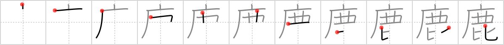

## `deer`

## [11]

## Reading:

### On-Yomi: ロク &mdash; Kun-Yomi: しか、か

## Heisig story:

Drawn on the walls of a complex of <i>caves</i> near Niaux in southern France are a number of animal likenesses dating from the Upper Paleolithic period. Among them we find pictures of <b>deer</b>, some of them showing men in <b>deer</b> masks. By <i>comparing</i> their drawings to real <b>deer</b>, Stone Age people hoped to acquire power over the animal in the hunt; and by <i>comparing</i> themselves to the <b>deer</b>, to take on that animal's characteristics. But time has locked with a &quot;double-<i>key</i>&quot; (the extra stroke through the element for <i>key</i>) the real secret of this art form from us, and we can only surmise such meanings. But more important than the enigmas of the troglodytic mind is the way in which <i>caves</i>, a double-<i>key</i>, and <i>comparing</i> gives us the kanji for <b>deer</b>.

## Premitive:

As a primitive, this kanji is abbreviated much the same as the tiger was: the lower element is dropped to leave room for a replacement: --. Its meaning, however, remains the same. There are a very few cases (see FRAME 2002 麗) in which there is no abbreviation. When this happens, we may keep the image suggested by the above explanation: painting of a deer.

## Koohii stories:

1) [<a href="http://kanji.koohii.com/profile/synewave">synewave</a>] 1-5-2007(300): <em>Bambi</em> wanders into a <em>cave</em> and sees a <em>side order of salad</em> and <em>2 spoons</em>...but what&#039;s the main course?

2) [<a href="http://kanji.koohii.com/profile/CharleyGarrett">CharleyGarrett</a>] 26-4-2007(37): Santa&#039;s rein<strong>deer</strong>, Rudolf, opens a nightclub in a <em>cave</em>. It&#039;s popular with all the <strong>deer</strong> and rein<strong>deer</strong> in the world. The <em>cave</em> speciality is a <em>salad w/ dressing on the side</em>. There is no other <strong>deer</strong> club that can <em>compare</em>. How many other <strong>deer</strong> nightclubs are there?

3) [<a href="http://kanji.koohii.com/profile/gavin.schultz-ohkubo">gavin.schultz-ohkubo</a>] 29-11-2010(23): See book. No, don&#039;t. :P.

4) [<a href="http://kanji.koohii.com/profile/RoboTact">RoboTact</a>] 1-9-2007(16): This is a <strong>deer</strong> from the <em>Old West</em>. Just <em>compare</em> it to European kind.

5) [<a href="http://kanji.koohii.com/profile/Stian">Stian</a>] 2-9-2012(14): Congratulations, you can now spell バカ with kanji; 馬鹿 . ;).

6) [<a href="http://kanji.koohii.com/profile/jabberwockychortles">jabberwockychortles</a>] 29-10-2009(14): I took my <em>salad with dressing on the side</em> into the <em>cave</em> to eat lunch while I <em>compare</em> the<strong> deer</strong> paintings on the wall to modern art.

7) [<a href="http://kanji.koohii.com/profile/tryllid">tryllid</a>] 21-2-2009(6): Cave + double keys + Compare:<strong> Deer</strong> in <em>caves</em> seem to have more freedom than<strong> deer</strong> in zoos, who live behind <em>double key</em> locks and <em>compared</em> to &#039;free&#039;<strong> deer</strong>, seem almost resigned to their fate.

8) [<a href="http://kanji.koohii.com/profile/einahpets">einahpets</a>] 26-2-2012(3): In a <em>building</em> in the <em>old west</em> the hunters get together and <em>compare</em> the<strong> deer</strong> they shot that day.

9) [<a href="http://kanji.koohii.com/profile/Harrow">Harrow</a>] 28-3-2009(3): <strong>Deer</strong> walks into a cave and orders a side salad, which the waiter takes from a locked case.<strong> Deer</strong> compares the salad to the picture on the menu and complains. I thought this was supposed to have tulips on it? [Deers routinely mow down tulips -- they love them!].

10) [<a href="http://kanji.koohii.com/profile/Katsuo">Katsuo</a>] 9-12-2007(3): In a <em>cave</em> is an ancient wall-drawing of a<strong> deer</strong>. You are looking at the<strong> deer</strong>’s <em>head &amp; antlers</em> (pictographic: strokes 4-7) and <em>comparing</em> it to a real<strong> deer</strong> that is standing nearby.
