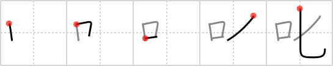

## `scold`

## [5]

## Reading:

### On-Yomi: シツ、シチ &mdash; Kun-Yomi: しか.る

### Examples: 叱る (しか.る)

## Words:

叱る(しかる): scold

## Koohii stories:

1) [<a href="http://kanji.koohii.com/profile/sweetneet">sweetneet</a>] 20-3-2006(78): A kid gets<strong> scold</strong>ed if they don&#039;t put the <em>spoon</em> properly into their <em>mouth</em> when eating. 

2) [<a href="http://kanji.koohii.com/profile/Yozora">Yozora</a>] 6-9-2009(36): Kids get<strong> scold</strong>ed if they don&#039;t open their MOUTH to take their SPOONFUL of medicine. 

3) [<a href="http://kanji.koohii.com/profile/paasan">paasan</a>] 5-7-2010(12): Here&#039;s a story I read many years ago in a magazine. It was about a girl who was lonely and wanting and decided to play with a banana. While doing this, she suddenly heard her parents returning home, and being startled, the banana broke inside her. Her mom then had to use a spoon to get the banana out of this poor girl while she was being <strong>scolded</strong>. So actually, this is a pictograph.. 

4) [<a href="http://kanji.koohii.com/profile/Nukemarine">Nukemarine</a>] 21-6-2008(12): Well, how do you picture getting<strong> SCOLD</strong>ED? You listen to that MOUTH while you have to SIT DOWN there and take it. 

5) [<a href="http://kanji.koohii.com/profile/decals">decals</a>] 11-11-2010(5): This is NOT spoon. The first stroke of the RHS goes beyond the second stroke. It&#039;s diced. STORY: When I try to make dinner, my wife<strong> scold</strong>s me because of my poor dicing technique. &quot;This is too big! It will never fit in our mouths! Dice it again!&quot;. 

6) [<a href="http://kanji.koohii.com/profile/yoshw">yoshw</a>] 13-6-2012(3): Open your <em>mouth</em> wide, here comes the <em>spoon</em>plane – hey, open up, or I&#039;ll<strong> scold</strong> you! 

7) [<a href="http://kanji.koohii.com/profile/spleenlol">spleenlol</a>] 28-7-2010(2): The Japanese girl&#039;s mom<strong> scold</strong>ed her with her <em>mouth</em> for using a <em>spoon</em> instead of chopsticks to eat her rice. 

8) [<a href="http://kanji.koohii.com/profile/KanjiVirtuoso">KanjiVirtuoso</a>] 18-10-2012(1): Such cruel parents! They used to<strong> scold</strong> me with an enormous <em>spoon</em>, by whacking my <em>mouth</em> right off my face! [I know this is meant to be <em>diced</em>, but a change in stroke direction to me is enough to make it worth remembering as <em>spoon</em>. You can remember the follow-through of the 4th stroke in the same way as you remember it for <a href="../111">outside</a> (#111 <a href="http://jisho.org/kanji/details/外">外</a>)]. 

9) [<a href="http://kanji.koohii.com/profile/kanjihito">kanjihito</a>] 25-2-2012(1): <em>mouth</em> towering over <em>sitting</em> form in an attempt to<strong> scold</strong> it into submission. 

10) [<a href="http://kanji.koohii.com/profile/NeoGlitch">NeoGlitch</a>] 25-11-2011(1): Have you ever used your <em>mouth</em> to <em>dice</em> somebody else&#039;s ego? That&#039;s called<strong> scold</strong>ing. 
