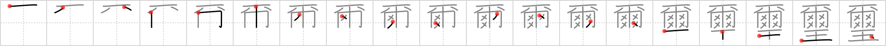

## `imperial seal`

## [19]

## Reading:

### On-Yomi: ジ

## Koohii stories:

1) [<a href="http://kanji.koohii.com/profile/mantixen">mantixen</a>] 11-10-2008(65): If you find a <em>jewel</em> with the<strong> imperial seal</strong> on it, just <em>let it be</em>. You wouldn&#039;t want to be accused of stealing the royal family <em>jewels</em>.

2) [<a href="http://kanji.koohii.com/profile/CharleyGarrett">CharleyGarrett</a>] 14-12-2006(53): This aquatic mammal belongs to the emperor, so it&#039;s an <strong>imperial seal</strong>. Nobody is allowed to mess with it. They have to <em>let it be</em> wherever it wants to go. You can spot it from the other seals by the <em>jewel</em> studded collar around the neck of the <strong>imperial seal</strong>, but above all, remember to <em>let it be</em>.

3) [<a href="http://kanji.koohii.com/profile/synewave">synewave</a>] 1-5-2007(11): You might not like the<strong> imperial seal</strong> but the boss man designed it himself so it&#039;s a <em>jewel</em> that you should just <em>let be</em>. This is apparently the only 常用漢字 not included in RTK1.

4) [<a href="http://kanji.koohii.com/profile/astridtops">astridtops</a>] 30-8-2006(10): The<strong> imperial seal</strong> is carved from a big <em>jewel</em>. The emperor uses it to seal new laws, while positioned over it, saying <em>&quot;Let it be&quot;</em>.

5) [<a href="http://kanji.koohii.com/profile/kapalama">kapalama</a>] 6-9-2011(2): 剣璽 , 璽符 , 御璽 , 国璽 , 玉璽 , <a href="../2075">imperial seal</a> (#2075 璽)ジ( 爾 ) ... Parts: 爾 , 玉 (cf: 爾 <a href="../2074">let it be</a> (#2074 爾), 彌生 /弥生<a href="../2241">more and more</a> (#2241 弥)) ... Story: なんじ( 爾 ) is the imperial <em>Ball</em> at? My invitation with the <strong>Imperial Seal</strong> on it had the time written on it. But what with the <strong>Imperial Seal</strong> dripping on it, I no longer know なんじ it is at. Better to put なんじ on top next time.

6) [<a href="http://kanji.koohii.com/profile/eutamias">eutamias</a>] 24-7-2011(2): &quot;LET IT BE&quot; are the words that are part of the<strong> IMPERIAL SEAL</strong> the is on all the new English king&#039;s JEWELS because he loves the Beatles.

7) [<a href="http://kanji.koohii.com/profile/Crowfoot">Crowfoot</a>] 7-4-2008(2): The imperial court was thinking of adding a fancy-looking <em>jewel</em> to the bottom of the<strong> imperial seal</strong>, so they called up McCartney to ask for his opinion. He just said, &quot;Nah, <em>let it be</em>&quot;.

8) [<a href="http://kanji.koohii.com/profile/oregum">oregum</a>] 26-10-2011(1): WOLVERINE cut FOUR<strong> IMPERIAL SEAL</strong>S into a JEWEL.

9) [<a href="http://kanji.koohii.com/profile/ReVoLynx">ReVoLynx</a>] 10-7-2011(1): The new emperor has a funny way of sealing his documents. He has his pet walk on a <em>towel</em> with his <em>animal legs</em>. Being 4-legged, this pet leaves 4 &quot;<em>x</em>&quot;s on the towel. The emperor finished the<strong> imperial seal</strong> off by stamping it with a jewel.

10) [<a href="http://kanji.koohii.com/profile/Regular">Regular</a>] 21-10-2010(1): What should the<strong> Imperial Seal</strong> be? Let it be.... Jewels!
