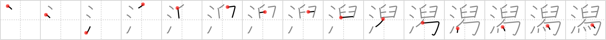

## `lagoon`

## [15]

## Reading:

### On-Yomi: セキ &mdash; Kun-Yomi: かた、-がた

## Koohii stories:

1) [<a href="http://kanji.koohii.com/profile/RoboTact">RoboTact</a>] 2-9-2007(139): Right part: <em>mortar</em> <em>bound up</em> over <em>oven fire</em>, comprising <em>boiling cauldron</em>. <strong>Lagoon</strong> is a shallow pond, thus easily warmed by sun, large-scale equivalent of a <em>boiling cauldron</em>.

2) [<a href="http://kanji.koohii.com/profile/fuaburisu">fuaburisu</a>] 15-1-2006(44): The top right primitive appears in Remembering the Kanji, Volume 3 : <em>mortar</em> = <em>back-to-back staples</em> [6] (&quot;The mortar referred to here is a stone or wooden basin used for grinding with a pestle.&quot;). Thus we have <em>water . . . mortar . . . bound up . . . cooking fire</em>.

3) [<a href="http://kanji.koohii.com/profile/rtkrtk">rtkrtk</a>] 18-3-2008(43): In an effort to appease the hideous monster from the black<strong> lagoon</strong>, nearby villagers grind up <em>tail feathers</em> of local birds in a <em>mortar</em> and sprinkle the powder in the <em>water</em>, in a primitive magic ritual that they hope will appease the monster. Note the first drop before the tail feathers, as the hook stroke of tail feathers always requires a vertical-like stroke to attach to (compare with do, bird).

4) [<a href="http://kanji.koohii.com/profile/Katsuo">Katsuo</a>] 3-3-2007(18): While visiting Niigata ( 新潟 ) I come across a<strong> lagoon</strong> and notice big splashes of <em>water</em> occurring every few seconds. It is their mortar-throwing contest where they bind up a <em>mortar</em> with <em>tail-feathers</em> (to make it fly better) and then see who can throw it furthrest across the<strong> lagoon</strong>.

5) [<a href="http://kanji.koohii.com/profile/ellasevia">ellasevia</a>] 4-8-2010(15): PRIMITIVE: The new element here (top right) is what I am calling <em>gray</em>, because it is similar to white, except that it has a leak at the top which lets darkness in. Therefore, the white turns to gray. STORY: The <em>gray</em> <em>water</em> of <strong>lagoons</strong> is due to the <em>gray</em> ashes of <em>bound up</em> <em>oven fires</em> (campfires) that some people have on the shore. Then the waves and wind move them into the <em>water</em> making it look filthy.

6) [<a href="http://kanji.koohii.com/profile/raulir">raulir</a>] 11-4-2007(9): Ancient rite for making a<strong> lagoon</strong>: mash some tail feathers in a mortar and sprinkle them in a body of water.

7) [<a href="http://kanji.koohii.com/profile/fergal">fergal</a>] 25-11-2009(7): 舄 is a character itself meaning magpie or clogs (I&#039;ve added a story for it, just paste it into the BROWSE box). You are walking into this beautiful <strong>lagoon</strong>, your <em>clogs</em> still on because you don&#039;t want to be cut by the sharp rocks. You turn around and see a <em>magpie</em> stealing your jewellery! You run after it still <em>dripping with water</em>.

8) [<a href="http://kanji.koohii.com/profile/tharvey">tharvey</a>] 10-8-2009(6): Beside the<strong> lagoon</strong>&#039;s <em>waters</em> she cooled herself with a fan she had fashioned out of <em>two staples</em> and some <em>tail feathers</em>.

9) [<a href="http://kanji.koohii.com/profile/Copycatken">Copycatken</a>] 26-8-2006(5): <em>Back-to-back staples</em> are used in order to <em>bound up</em> the loose <em>tail feathers</em> that I found in the <em>waters</em> of the<strong> lagoon</strong>.

10) [<a href="http://kanji.koohii.com/profile/bizarrojosh">bizarrojosh</a>] 8-2-2010(4): A man made<strong> LAGOON</strong> is created with WATER, MORTAR and a BOUND UP OVEN FIRE to keep it heated.

### {V4: 2039, V6: 2195}
