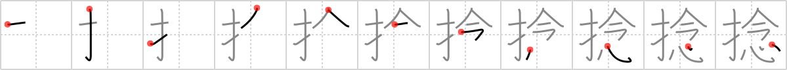

## `wrench`

## [11]

## Reading:

### On-Yomi: ネン、ジョウ &mdash; Kun-Yomi: ね.じる、ねじ.る、ひね.くる、ひね.る

## Heisig V6:

This kanji does not refer to the tool but to the act of twisting. Its elements: <i>fingers</i> . . . <i>wish.</i>

## Koohii stories:

1) [<a href="http://kanji.koohii.com/profile/astridtops">astridtops</a>] 25-10-2006(33): Bad guys in movies always<strong> twirl</strong> their moustache with their <em>fingers</em>, and <em>that sort of thing</em>.

2) [<a href="http://kanji.koohii.com/profile/At0m5k">At0m5k</a>] 9-8-2009(12): I know you like cute girls who<strong> twirl</strong> their hair with their fingers, that <em>sort of thing</em> can really get any guy going.

3) [<a href="http://kanji.koohii.com/profile/timcampbell">timcampbell</a>] 25-11-2008(8): Ever noticed that<strong> twirl</strong>y <em>sort of a thing</em> that Asians do when they are holding a pen in their <em>fingers</em>?

4) [<a href="http://kanji.koohii.com/profile/herman">herman</a>] 2-1-2009(4): Use your fingers to<strong> twirl</strong> your hot-dog over a fire.

5) [<a href="http://kanji.koohii.com/profile/mantixen">mantixen</a>] 15-10-2008(4): I like it when girls do that<strong> twirl</strong> <em>sort of thing</em> with their <em>fingers</em> in their hair.

6) [<a href="http://kanji.koohii.com/profile/dihutenosa">dihutenosa</a>] 28-7-2008(2): The <em>hot-diggity, dog-diggity sort-of-thing</em> by the side of the road in China is selling <em>finger</em> foods as well. They&#039;re above the fire on a spit, and the cart-owner makes sure to <em>twirl</em> them every once in a while so that they are evenly cooked.

7) [<a href="http://kanji.koohii.com/profile/nussram">nussram</a>] 5-1-2013(1): The man<strong> twirl</strong>s his moustache with his <em>finger</em> as he contemplates eating that <em>hot-diggity, dog-diggity sort-of-thing</em>.

8) [<a href="http://kanji.koohii.com/profile/Katsuo">Katsuo</a>] 7-1-2008(1): A novice model is asked to do a<strong> twirl</strong> but she<strong> twirl</strong>s her <em>fingers</em> instead saying “You mean this <em>sort of thing</em>?”.

9) [<a href="http://kanji.koohii.com/profile/Miyumera">Miyumera</a>] 18-7-2012(): The &quot;dog SORT OF THING&quot; dish is on the table.. and you take your FINGERS and<strong> twirl</strong> it around. Picture your fingers over the dog meat.

10) [<a href="http://kanji.koohii.com/profile/eggcluck">eggcluck</a>] 10-10-2011(): Fingers<strong> twirl</strong> around the twisted burned alive dog in the latest modern art exhibit.
