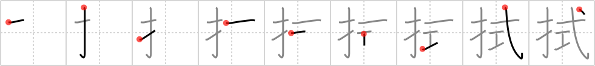

## `wipe`

## [9]

## Reading:

### On-Yomi: ショク、シキ &mdash; Kun-Yomi: ぬぐ.う、ふ.く

## Heisig V6:

Fingers . . . style.

## Koohii stories:

1) [<a href="http://kanji.koohii.com/profile/ikmys">ikmys</a>] 1-5-2007(81): &quot;Come on people, the only way to<strong> make headway</strong> in this business is to let your <em>fingers</em> do the <em>walking</em>!&quot; bust out the yellow pages and dial as many numbers as possible, surely someone is a sucker for a cold call sell.

2) [<a href="http://kanji.koohii.com/profile/icamonkey">icamonkey</a>] 18-8-2009(15): You can&#039;t just point with a <em>finger</em> and<strong> make headway</strong>, you have to actually walk* there.

3) [<a href="http://kanji.koohii.com/profile/Puchatek">Puchatek</a>] 25-7-2011(10): <em>Walking</em> on your <em>fingers</em> it&#039;s really difficult to<strong> make headway</strong> - any progress at all is very slow.

4) [<a href="http://kanji.koohii.com/profile/mantixen">mantixen</a>] 15-10-2008(7): Even if you <em>walk</em> with your <em>fingers</em>, it&#039;s important to continue to<strong> make headway</strong> and never give up.

5) [<a href="http://kanji.koohii.com/profile/n1williams">n1williams</a>] 22-11-2009(4): The best way to<strong> MAKE HEADWAY</strong>, is to let your FINGERS do the WALKING.

6) [<a href="http://kanji.koohii.com/profile/amillerchip">amillerchip</a>] 11-2-2013(3): <a href="http://www.youtube.com/watch?v=DuxChWh0f1I">http://www.youtube.com/watch?v=DuxChWh0f1I</a>　.

7) [<a href="http://kanji.koohii.com/profile/faneca">faneca</a>] 26-8-2012(3): <strong>STROKES</strong>: Note that some sources show an <strong>alternate form</strong>, with <strong>10 strokes instead of 11</strong>, where <strong>the <em>few</em> primitive lacks its third stroke</strong>.

8) [<a href="http://kanji.koohii.com/profile/Machine_Gun_Cat">Machine_Gun_Cat</a>] 14-7-2009(2): I use my pimp <em>hand</em> to slap slow <em>walkers</em> out of the way when I make my headway down the road. Needless to say I&#039;m often a recipient of the finger.

9) [<a href="http://kanji.koohii.com/profile/dihutenosa">dihutenosa</a>] 28-7-2008(2): <em>Fingers</em> is being chased by the cops, who are starting to<strong> make headway</strong> on him. <em>Fingers</em>, thinking quickly, hops into a crowd of old folks who are <em>walking</em> for fitness. <em>Fingers</em>, who is pretty short, blends in nicely with the old geezers, and starts to<strong> make headway</strong> towards the front of the pack, where he can start to sprint again - but for now, he is power <em>walk</em>ing.

10) [<a href="http://kanji.koohii.com/profile/woelpad">woelpad</a>] 16-4-2008(2): <em>Fingers</em> is trying to crack a safe, but he&#039;s <strong>making</strong> no <strong>headway</strong>. So he decides to take a <em>walk</em>, get some fresh air. Always a sensible idea when you&#039;re dealing with number problems.
