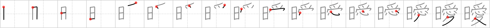

## `unclear`

## [17]

## Reading:

### On-Yomi: アイ &mdash; Kun-Yomi: くら.い

## Words:

曖昧(あいまい): vague, ambiguous

## Koohii stories:

1) [<a href="http://kanji.koohii.com/profile/mantixen">mantixen</a>] 15-2-2007(91): The <em>sun</em>&#039;s <em>love</em> is<strong> equivocal</strong>: it warms yet burns us. 

2) [<a href="http://kanji.koohii.com/profile/perrin4869">perrin4869</a>] 17-9-2010(21): Inspired by haabaato: You confess your <em>love</em> under the <em>sun</em>, but the girl runs away. Her response is <strong>unclear</strong> to you (Using the supplement&#039;s keyword). 

3) [<a href="http://kanji.koohii.com/profile/FoxintheStars">FoxintheStars</a>] 18-1-2011(16): In RTK1 Supplement as &quot;unclear.&quot; His feelings about her were <strong>equivocal/unclear,</strong> so she spent all <em>day</em> playing &quot;<em>loves</em> me, loves me not.&quot;. 

4) [<a href="http://kanji.koohii.com/profile/haabaato">haabaato</a>] 13-3-2008(13):   <a href="http://jisho.org/kanji/details/曖昧。">曖昧。</a>   On a <em>sunny</em> day, a guy professes his <em>love</em> to a girl he admires. But she gives him the common<strong> equivocal</strong> response, &quot;Let&#039;s just be friends.&quot;. 

5) [<a href="http://kanji.koohii.com/profile/decals">decals</a>] 10-11-2010(5): (Thanks HaaBaato)   <a href="http://jisho.org/kanji/details/曖昧。">曖昧。</a>   On a <em>sunny</em> day, a guy professes his <em>love</em> to a girl he admires. However, while he&#039;s down on one knee, the sun comes out from behind a cloud and blinds him. The girl takes her opportunity, gives him the common<strong> equivocal</strong> response, &quot;Let&#039;s just be friends,&quot; and runs away while the poor guy is still blinded. 

6) [<a href="http://kanji.koohii.com/profile/kitsunebi77">kitsunebi77</a>] 18-2-2012(4): In the light of <em>day</em>, what had seemed like <em>love</em> the drunken night before now felt much more <strong>unclear</strong>. 

7) [<a href="http://kanji.koohii.com/profile/kapalama">kapalama</a>] 14-10-2010(4):   <a href="http://jisho.org/kanji/details/曖昧">曖昧</a>  <a href="../2437">equivocal</a> (#2437 <a href="http://jisho.org/kanji/details/曖">曖</a>)アイ ... Parts:   <a href="http://jisho.org/kanji/details/日">日</a>  ,   <a href="http://jisho.org/kanji/details/愛">愛</a>   ...   <a href="http://jisho.org/kanji/details/日本">日本</a>   Wikipedia: Disambiguation Page=曖昧さ回避. look up ももfor an example.   <a href="http://jisho.org/kanji/details/曖">曖</a>   <a href="../2437">equivocal</a> (#2437 <a href="http://jisho.org/kanji/details/曖">曖</a>) and   <a href="http://jisho.org/kanji/details/昧">昧</a>  <a href="../2445">obscure</a> (#2445 <a href="http://jisho.org/kanji/details/昧">昧</a>) are rarely used outside of this word in modern Japanese. So the story for this Kanji should use this fact. Using   <a href="http://jisho.org/kanji/details/日">日</a>   as Japan: I <em>love</em> to disambiguate (  <a href="http://jisho.org/kanji/details/曖昧さ回避">曖昧さ回避</a>  ) <strong>equivocal</strong> <em>Japanese</em> words. 

8) [<a href="http://kanji.koohii.com/profile/Meconium">Meconium</a>] 21-2-2011(2): Never make <em>love</em> to someone of<strong> equivocal</strong> (<strong>ambiguous</strong>) gender while the <em>sun</em> is out, because that&#039;s gross. (Anyone who reports this story is a tranny!). 

9) [<a href="http://kanji.koohii.com/profile/astridtops">astridtops</a>] 11-12-2006(2): He was rather<strong> equivocal</strong> about expressing <em>love</em>, every <em>day</em> he wouldn&#039;t tell exactly where he stood. 

10) [<a href="http://kanji.koohii.com/profile/usis35">usis35</a>] 28-11-2012(1):   <a href="http://jisho.org/kanji/details/曖昧">曖昧</a>   【あいまい】 VAGUE, AMBIGUOUS.   <a href="http://jisho.org/kanji/details/曖">曖</a>   <a href="../2437">equivocal</a> (#2437 <a href="http://jisho.org/kanji/details/曖">曖</a>) and   <a href="http://jisho.org/kanji/details/昧">昧</a>   <a href="../2445">obscure</a> (#2445 <a href="http://jisho.org/kanji/details/昧">昧</a>) are rarely used outside of this word in modern Japanese. 2 stories in one: I proposed her LOVE only for that DAY. The answer was AMBIGUOUS, OBSCURE. She was NOT YET prepared. 
