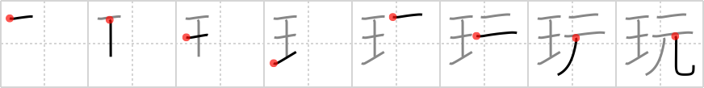

## `toy`

## [8]

## Reading:

### On-Yomi: ガン &mdash; Kun-Yomi: もちあそ.ぶ、もてあそ.ぶ

## Heisig V6:

If, at some aboriginal level, <b>Toys</b> Я Us, then the archetypal <i>ball</i> must have been there at the <i>beginning</i>, before evolving into beach balls, ping-pong balls, rugby balls, and marbles.

## Koohii stories:

1) [<a href="http://kanji.koohii.com/profile/ikmys">ikmys</a>] 5-7-2007(16): Last time I was on <em>crag&#039;s list</em>, I found someone selling an <em>aircraft carrier</em> they carved out of <em>stone</em>! A crazy lawn ornament I suppose.

2) [<a href="http://kanji.koohii.com/profile/astridtops">astridtops</a>] 11-1-2007(14): If you want to take all the <em>stones</em> out of this<strong> crag</strong>, you&#039;ll need a large <em>carrier</em>.

3) [<a href="http://kanji.koohii.com/profile/icamonkey">icamonkey</a>] 13-12-2009(5): The carrier got stuck on a large stone, also known as a<strong> crag</strong>.

4) [<a href="http://kanji.koohii.com/profile/paasan">paasan</a>] 23-7-2010(4): This is the modern version of Noah&#039;s ark -- As the water level declined (see, no water), the aircraft <em>carrier</em> stranded on a big <em>rock</em>, later to be found out to be a <strong>crag</strong>. And out of the carrier stepped two and two of each army vehicle there was and populated the earth once again.

5) [<a href="http://kanji.koohii.com/profile/Meconium">Meconium</a>] 17-2-2010(2): The <em>aircraft carrier</em> got stuck on a large <em>rock</em> near<strong> Crag</strong>gy Island, home of Father Ted.

6) [<a href="http://kanji.koohii.com/profile/tehssb">tehssb</a>] 9-12-2009(2): If you are the first to make it to the top of the agro<strong> crag</strong>, you will be the <em>carrier</em> of the trophy, that is, a big <em>stone</em>, a piece of the<strong> crag</strong>.

7) [<a href="http://kanji.koohii.com/profile/Neobeo">Neobeo</a>] 14-1-2009(2): I strategically hid behind a<strong> crag</strong> so that when the <em>carrier</em> ship shot missiles at me, the rocks would tumble and rebound onto the <em>carrier</em> instead.

8) [<a href="http://kanji.koohii.com/profile/perrin4869">perrin4869</a>] 2-3-2012(1): This is the image of a <em>carrier</em>, half buried in the middle of the desert - from far away it looks like a <strong>crag</strong> (a <em>stone</em>), but as you get closer, you realize what it is, and wonder - how did it get there!?

9) [<a href="http://kanji.koohii.com/profile/Boy.pockets">Boy.pockets</a>] 26-1-2011(1): The <em>carrier</em> shot at the <em>rocks</em> to turn them into a<strong> crag</strong>.

10) [<a href="http://kanji.koohii.com/profile/richcoop">richcoop</a>] 18-8-2009(1): The<strong> crag</strong> is where the CARRIER was hit with ROCKS.
