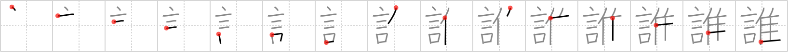

## `who`

## [15]

## Reading:

### On-Yomi: スイ &mdash; Kun-Yomi: だれ、たれ、た

## Koohii stories:

1) [<a href="http://kanji.koohii.com/profile/cameron_en">cameron_en</a>] 28-11-2008(87): Do you remember that song where they <em>say</em> &quot;<strong>Who</strong> let the <em>turkeys</em> out!? Gobble.. gobble.. gobble&quot;? 

2) [<a href="http://kanji.koohii.com/profile/Ricardo">Ricardo</a>] 5-2-2007(40): [who; someone; somebody] You&#039;re alone when, suddenly, you think you hear someone <em>speak</em>ing. &quot;<strong>Who</strong>&#039;s there?&quot;, you <em>say</em>, but there is no answer. Then you find out it was only a <em>turkey</em> gobbling. You feel relieved (and ashamed to tell this story). (Based on raulir). 

3) [<a href="http://kanji.koohii.com/profile/Wally">Wally</a>] 10-4-2009(23): <strong>Who</strong> talks turkey? (I&#039;m surprised this common American phrase &#039;talk turkey&#039; hasn&#039;t made it in here. It is North American centric, however -- and how the <em>heck</em> is this <em>not</em> in RTK 1? I mean, primary school kids have to know this kanji.). 

4) [<a href="http://kanji.koohii.com/profile/raulir">raulir</a>] 29-4-2006(16): &quot;<strong>Who</strong>&#039;s there?&quot; he says, but it was only a turkey. 

5) [<a href="http://kanji.koohii.com/profile/hknamida">hknamida</a>] 21-1-2008(11): <em>Socrates</em> spins around, startled. &quot;<strong>Who</strong>&#039;s there?&quot; It turns out that it is only a <em>turkey</em>, and the philosopher is safe... for now. （だれ）. 

6) [<a href="http://kanji.koohii.com/profile/Meconium">Meconium</a>] 24-2-2010(6): &quot;Which one of you said the <em>T-word</em>? <strong>Who was it?</strong>&quot; asked the angry teacher to his class of unruly students. &quot;...you mean <em>turkey</em>?&quot; came a voice from the crowded classroom. <strong>&quot;WHO SAID THAT?!&quot;</strong>. 

7) [<a href="http://kanji.koohii.com/profile/johndel">johndel</a>] 22-1-2009(4): Bird says &quot;who&quot; &quot;who&quot;. 

8) [<a href="http://kanji.koohii.com/profile/lernsky">lernsky</a>] 10-1-2013(3): In the beginning there was the <em>word</em>. But after that? <em>Turkey</em> or egg? <strong>Who</strong> or what? 

9) [<a href="http://kanji.koohii.com/profile/nesert">nesert</a>] 29-2-2012(3): &quot;<strong>Who?</strong>....<strong>who?</strong>...&quot; <em>says</em> the <em>turkey</em> trying his best to mislead you as to <strong>who</strong> he is and thereby avoid the dinner table. 

10) [<a href="http://kanji.koohii.com/profile/Es2Key">Es2Key</a>] 3-2-2011(3): <strong>Who</strong> said turkey doesn&#039;t taste good? 
