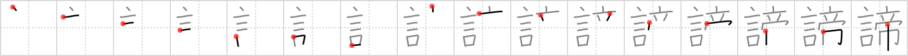

# {諦}

## `renunciation`

## Strokes: 16

## Reading:

### On-Yomi: テイ、タイ &mdash; Kun-Yomi: あき.らめる、あきら.める、つまびらか、まこと

### Examples: 諦める (あきら.める)

## Words:

諦め(あきらめ): resignation, acceptance, consolation

諦める(あきらめる): give up, abandon
