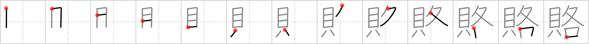

## `graft`

## [13]

## Reading:

### On-Yomi: ロ &mdash; Kun-Yomi: まいな.い、まいな.う

## Koohii stories:

1) [<a href="http://kanji.koohii.com/profile/Megaqwerty">Megaqwerty</a>] 16-7-2007(68): It might sound simple to bribe someone, but then you have to<strong> graft</strong> the guy above him and the guy below him, and soon you&#039;re just giving <em>shells</em> to <em>each</em> and everyone! 

2) [<a href="http://kanji.koohii.com/profile/cameron_en">cameron_en</a>] 28-11-2008(18): When I was caught by the police doing some<strong> graft</strong> (graffiti), I gave <em>each</em> cop some <em>clams</em> and told them to be on their way.   <a href="http://jisho.org/kanji/details/賄賂">賄賂</a>  【わいろ】 bribe. 

3) [<a href="http://kanji.koohii.com/profile/hunchbag">hunchbag</a>] 7-9-2011(10): <em>Graft: the acquisition of money, gain, or advantage by dishonest, unfair, or illegal means, especially through the abuse of one&#039;s position or influence in politics, business, etc. .</em> <em>STORY:</em> The evil corporate extortionist<strong> graft</strong>s all who get within his power. He<strong> GRAFT</strong>s a different amount of MONEY from EACH of his victims. If they have more, he extorts more. He even plots it out on an evil graph! 

4) [<a href="http://kanji.koohii.com/profile/doviende">doviende</a>] 23-10-2011(6): <strong>Graft</strong> is like bribing. You have to give <em>MONEY</em> to <em>EACH</em> person. There&#039;s a guy with a briefcase full of money and a walky-talky, and he&#039;s going around asking on the walky-talky about who he should give money too. &quot;This guy gets money? Roger.&quot;. 

5) [<a href="http://kanji.koohii.com/profile/blannk">blannk</a>] 30-10-2009(5): I take this to mean the verb<strong> graft</strong>, and so simply see a bunch of shellfish being <strong>grafted</strong> onto <em>each</em> other, <em>each</em> to <em>each</em>. 

6) [<a href="http://kanji.koohii.com/profile/aaroncp">aaroncp</a>] 26-9-2011(3): The evil politician <strong>extorted</strong> <em>money</em> and influence from <em>each</em> person around him to maintain his power. Note: I changed the keyword to extort because it is much easier to remember than this strange definition of<strong> graft</strong> and has a similar meaning. 

7) [<a href="http://kanji.koohii.com/profile/kapalama">kapalama</a>] 26-9-2010(3):   <a href="http://jisho.org/kanji/details/賄賂">賄賂</a>  <a href="../2738">graft</a> (#2738 <a href="http://jisho.org/kanji/details/賂">賂</a>) ロ(  <a href="http://jisho.org/kanji/details/路">路</a>  ) ... Parts:  <a href="http://jisho.org/kanji/details/貝">貝</a>  ,   <a href="http://jisho.org/kanji/details/各">各</a>   or   <a href="http://jisho.org/kanji/details/貝">貝</a>  , (  <a href="http://jisho.org/kanji/details/路">路</a>  -  <a href="http://jisho.org/kanji/details/足">足</a>  ) ... Notes:Only used in   <a href="http://jisho.org/kanji/details/賄賂">賄賂</a>   (ワイロ, Bribe) ... Similar Keywords:   <a href="http://jisho.org/kanji/details/賄">賄</a>  <a href="../80">bribe</a> (#80 <a href="http://jisho.org/kanji/details/賄">賄</a>),   <a href="http://jisho.org/kanji/details/賂">賂</a>  <a href="../2738">graft</a> (#2738 <a href="http://jisho.org/kanji/details/賂">賂</a>) ... Story:Removing the <strong>grafted</strong> on <em>pegleg</em> and replacing it with money makes the <em>path</em> go smoother; that&#039;s why they call it greasing the skids. Of course it is <strong>graft</strong>, but that&#039;s just the way to get things done. <em>Each</em> person gets some, and things get done. ... cf: 駱駝. 

8) [<a href="http://kanji.koohii.com/profile/kanjihito">kanjihito</a>] 7-7-2012(1): Once you give into<strong> graft</strong>, soon you have to <em>shell</em> it out to <em>each</em> and every one whe finds out. 

9) [<a href="http://kanji.koohii.com/profile/Dartlak">Dartlak</a>] 25-5-2012(1): You can easily<strong> graft</strong> the government, but a different amount of <em>shells</em> is needed for <em>each</em> office. 

10) [<a href="http://kanji.koohii.com/profile/scarby+dancer">scarby+dancer</a>] 22-5-2012(1): &quot;Baksheesh (from Persian) is a term used to describe tipping, charitable giving, and certain forms of political corruption and bribery in the Middle East and South Asia.&quot; (Wiki) It&#039;s not hard to associate<strong> GRAFT</strong> with MONEY. MONEY talks. At EACH place we travelled to in India we had to use baksheesh, or as I now think of it, &quot;bakshEACH&quot;! 
