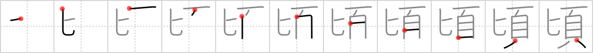

## `about that time`

## [11]

## Reading:

### On-Yomi: ケイ、キョウ &mdash; Kun-Yomi: ころ、ごろ、しばら.く

## Heisig V6:

When Uncle Bob starts his comic routine of sticking <i>spoons </i>on his <i>head</i>, you know it is <b>about that time</b>&nbsp;to come up with a reason to excuse yourself.

## Koohii stories:

1) [<a href="http://kanji.koohii.com/profile/Crowfoot">Crowfoot</a>] 20-4-2008(37): This is a <em>weak fish</em> -- you just open a can of<strong> sardine</strong>s and there they are, weak and defenseless, ready to be eaten.

2) [<a href="http://kanji.koohii.com/profile/mantixen">mantixen</a>] 30-7-2009(8): Due to its small size, the<strong> sardine</strong> is a <em>weak fish</em>.

3) [<a href="http://kanji.koohii.com/profile/oregum">oregum</a>] 11-6-2010(1): <strong>SARDINE</strong>S are WEAK little FISH.

4) [<a href="http://kanji.koohii.com/profile/timcampbell">timcampbell</a>] 14-2-2009(1): Tiny<strong> sardine</strong> are the <em>weakest fish</em> in the sea.

5) [<a href="http://kanji.koohii.com/profile/NeoGlitch">NeoGlitch</a>] 27-2-2012(): Have you ever eaten<strong> sardine</strong> <em>fish</em>es?? If you do, then you know they have like, the <em>weak</em>est bones ever. You can eat them whole with ease!

6) [<a href="http://kanji.koohii.com/profile/Boy.pockets">Boy.pockets</a>] 7-3-2011(): <strong>Sardine</strong>s are the <em>weakest fish</em>. That is why you can shove so many of them into one can.

7) [<a href="http://kanji.koohii.com/profile/decals">decals</a>] 11-2-2011(): <strong>Sardine</strong> <em>fish</em> are such <em>weak</em> little panzies that fisherman don&#039;t even have to hook them. They just say &quot;Hey! Get your A$$ in this can!&quot; Then the <em>weak</em> little guys just climb in and go to market.

8) [<a href="http://kanji.koohii.com/profile/kapalama">kapalama</a>] 16-11-2010(): 鰯 <a href="../2813">sardine</a> (#2813 鰯) 国字 , いわし ... Parts: 魚 , 弱 ... Story: This is apparently used like the word &#039;Shrimp&#039; is in English to call someone who is small or weak. So <em>Weak Fish</em> but remember that when you call someone a Shrimp in Japanese you have to call them a<strong> Sardine</strong>! small enough to eat off a cracker.

9) [<a href="http://kanji.koohii.com/profile/gavmck">gavmck</a>] 13-3-2010(): <strong>Sardine</strong>s often come canned so this <em>fish</em> is not a good choice for <em>weak</em>lings as the cans are hard to prise open.

10) [<a href="http://kanji.koohii.com/profile/Meconium">Meconium</a>] 8-3-2010(): In terms of how fast it can swim, the<strong> sardine</strong> may be considered a <em>weak fish</em>... but the instantly-recognisable smell is far from <em>weak</em>!
