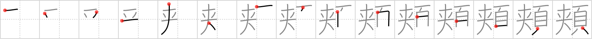

## `cheek`

## [15]

## Reading:

### On-Yomi: キョウ &mdash; Kun-Yomi: ほお、ほほ

### Examples: 頬 (ほお)

## Words:

頬(ほお): cheek (of face)

頬っぺた(ほっぺた): cheek

## Koohii stories:

1) [<a href="http://kanji.koohii.com/profile/mcfate">mcfate</a>] 23-11-2007(67): Your <strong>cheeks</strong> contain your jawbones, which are known as the &quot;<em>scissors</em> of the <em>head</em>.&quot;. 

2) [<a href="http://kanji.koohii.com/profile/herman">herman</a>] 26-11-2008(51): The Joker from Batman had his<strong> cheek</strong>s cut with scissors to give him that eternal smile. Now the Joker isn&#039;t right in the head. 

3) [<a href="http://kanji.koohii.com/profile/brose">brose</a>] 18-2-2007(8): Imagine using <em>scissors</em> to cut your<strong> cheek</strong>s off your <em>head</em> キョウ ほお ほほ. 

4) [<a href="http://kanji.koohii.com/profile/kanjihito">kanjihito</a>] 4-11-2012(3): She grabbed the <em>scissors</em> and slashed at her assailant&#039;s <em>head</em> and right through his<strong> cheek</strong>s. 

5) [<a href="http://kanji.koohii.com/profile/abaddon">abaddon</a>] 4-6-2008(3): Scissors, head: Stories from the emergency room: &#039;A guy came in with <em>scissors</em> stuck in his <em>head</em>. Said he wanted to trim the hair on his <strong>cheeks</strong>. It seemed more like he was practicing some kind of juggling trick.&#039;. 

6) [<a href="http://kanji.koohii.com/profile/shinryu">shinryu</a>] 26-5-2012(2): Think of Dexter (TV show character), whose killing ritual involves drawing blood from his victim&#039;s <strong>cheek</strong>. There is a good quote from Season 6 which can help, &quot;You don&#039;t turn the other <strong>cheek</strong> - you slice it!&quot;. The only problem is that this time Dexter has forgotten his trusty scalpel and has to make do with whatever he finds nearby - in this case, a pair of <em>scissors</em> to perform the ritual cut on the victim&#039;s <em>head</em> area. 

7) [<a href="http://kanji.koohii.com/profile/Puchatek">Puchatek</a>] 7-8-2011(2): For this kanji I think of those weird piercing festivals they hold in Thailand (yuck!). So here we see a guy put a pair of <em>scissors</em> into his <em>head</em>. He put them through one of his<strong> cheek</strong>s, and pushed it all the way through his <em>head</em>, so that the <em>scissors</em> now stick out his other<strong> cheek</strong>. Try forgetting this kanji now :P. 

8) [<a href="http://kanji.koohii.com/profile/alucardchuu">alucardchuu</a>] 2-8-2010(2): I&#039;d like to combine the stories of herman an brose: The Joker from Batman had his<strong> cheek</strong>s cut with scissors to give him that eternal smile. Now the Joker isn&#039;t right in the head：　キョウ ほお ほほ！(it sounds like the joker&#039;s laughter! キョウ ほお ほほ！). 

9) [<a href="http://kanji.koohii.com/profile/Katsuo">Katsuo</a>] 20-6-2007(2): Edward Scissorhands has a cousin Eddie <em>Scissor-head</em> whose <em>head</em> has been replaced by a large pair of <em>scissors</em>. If anyone stares at him he cuts out their<strong> cheek</strong>s while muttering, &quot;Bloody<strong> cheek</strong>!&quot;. 

10) [<a href="http://kanji.koohii.com/profile/n1williams">n1williams</a>] 14-1-2010(1): Ever see a person purse their lips then suck in their<strong> CHEEK</strong>S. It kinda looks like a large pair of SCISSORS cut part way thru their HEAD. 
