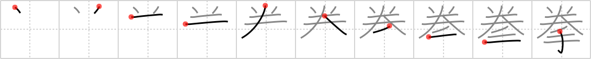

## `fist`

## [10]

## Reading:

### On-Yomi: ケン、ゲン &mdash; Kun-Yomi: こぶし

### Examples: 拳 (こぶし)

## Koohii stories:

1) [<a href="http://kanji.koohii.com/profile/mantixen">mantixen</a>] 31-7-2009(54): 1) I hold a roll of <em>quarters</em> in my <em>hand</em> when I make a<strong> fist</strong>. 2) I hold a <em>quarter</em> in my <em>hand</em> as I prepare to play the Iron<strong> Fist</strong> Tournament:   <a href="http://jisho.org/kanji/details/鉄拳">鉄拳</a>   （てっけん） at the arcade. 

2) [<a href="http://kanji.koohii.com/profile/abaddon">abaddon</a>] 15-6-2008(37): Quarter, hand: If you have a roll of <em>quarters</em> in your <em>hand</em>, your<strong> fist</strong> will deliver a much more effective punch. 

3) [<a href="http://kanji.koohii.com/profile/richcoop">richcoop</a>] 12-8-2009(14):   <a href="http://jisho.org/kanji/details/及">及</a>  <strong> fist</strong>* His<strong> fist</strong> is a QUARTER the size of his open HAND. 

4) [<a href="http://kanji.koohii.com/profile/Katsuo">Katsuo</a>] 8-11-2007(7): A<strong> fist</strong> is a <em>hand</em> that offers no <em>quarter</em>. 

5) [<a href="http://kanji.koohii.com/profile/einahpets">einahpets</a>] 27-2-2012(6): Your <em>hand</em> may only be a <em>quarter</em> of its usual size with the fingers spread out when you make a<strong> fist</strong> but it looks a lot tougher. 

6) [<a href="http://kanji.koohii.com/profile/kapalama">kapalama</a>] 27-11-2010(4):   <a href="http://jisho.org/kanji/details/拳遊び">拳遊び</a>  ,   <a href="http://jisho.org/kanji/details/拳銃">拳銃</a>  ,   <a href="http://jisho.org/kanji/details/拳骨">拳骨</a>  ,   <a href="http://jisho.org/kanji/details/鉄拳">鉄拳</a>  ,   <a href="http://jisho.org/kanji/details/拳闘">拳闘</a>  ,   <a href="http://jisho.org/kanji/details/じゃん拳">じゃん拳</a>  ,   <a href="http://jisho.org/kanji/details/鉄拳ファイター">鉄拳ファイター</a>  , <a href="../2917">fist</a> (#2917 <a href="http://jisho.org/kanji/details/拳">拳</a>)ケン, こぶし ... Parts: Quarter,   <a href="http://jisho.org/kanji/details/手">手</a>   (cf.   <a href="http://jisho.org/kanji/details/挙げる">挙げる</a>  <a href="../1938">raise</a> (#1938 <a href="http://jisho.org/kanji/details/挙">挙</a>),   <a href="http://jisho.org/kanji/details/券">券</a>  <a href="../1206">ticket</a> (#1206 <a href="http://jisho.org/kanji/details/券">券</a>)） ... Story: Think japanese<strong> Fist</strong>, then videogames like Tekken Fighter:   <a href="http://jisho.org/kanji/details/鉄拳ファイター">鉄拳ファイター</a>  . Which of course needs <em>Quarters</em> to pay, and <em>Hands</em> to play. 

7) [<a href="http://kanji.koohii.com/profile/BladeWalker">BladeWalker</a>] 4-7-2012(2): This is a pictograph of a <em>hand</em> shooting a <em>hadouken</em>, knocking an opponent to <em>quarter</em> health.   <a href="http://jisho.org/kanji/details/波動拳">波動拳</a>   (はどうけん) wave<strong> fist</strong>, or surge<strong> fist</strong>;   <a href="http://jisho.org/kanji/details/真空波動拳">真空波動拳</a>   (しんくうはどうけん) vacuum surge<strong> fist</strong>. 

8) [<a href="http://kanji.koohii.com/profile/dominikun">dominikun</a>] 3-2-2011(2): German: Wer früher die Faust zum Herrscher reckte, wurde unter Umständen sofort mit seinem Handstreich gevierteilt. 

9) [<a href="http://kanji.koohii.com/profile/n1williams">n1williams</a>] 20-1-2010(2): If you put a QUARTER in a child&#039;s HAND they&#039;ll instantly make it into a<strong> FIST</strong> so it doesn&#039;t get away. 

10) [<a href="http://kanji.koohii.com/profile/adamrandell1296">adamrandell1296</a>] 9-12-2012(1): This guy keeps asking me what time it is. &quot;A <em>quarter</em> to <strong>fist</strong>!&quot; I snap, and he gets a face-full of hand. 
