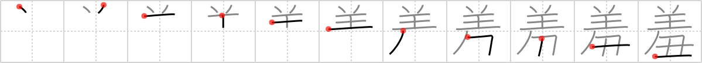

## `humiliate`

## [11]

## Reading:

### On-Yomi: シュウ &mdash; Kun-Yomi: すすめ.る、 はじ.る、 は.ずかしい

## Heisig V6:

Wool . . sign of the cow.

## Koohii stories:

1) [<a href="http://kanji.koohii.com/profile/thecite">thecite</a>] 10-1-2010(2): <strong>hungary</strong>: To the chinese, the Hungarians (huns) were considered villains wrapped up in fur coats.

2) [<a href="http://kanji.koohii.com/profile/chibimizuno">chibimizuno</a>] 16-1-2013(): The <em>villain</em> destroyed the entire country of <strong>Hungary</strong>, leaving its citizens destitute, <em>wrapping</em> themselves in rags and shivering in the cold, whispering &quot;I&#039;m so HUNGARY...&quot;.

This content is from Reviewing the Kanji webpage <a href="http://kanji.koohi.com">kanji.koohi.com</a>.

<a href="../21256">../21256</a>

"

NA

NA

NA

NA
